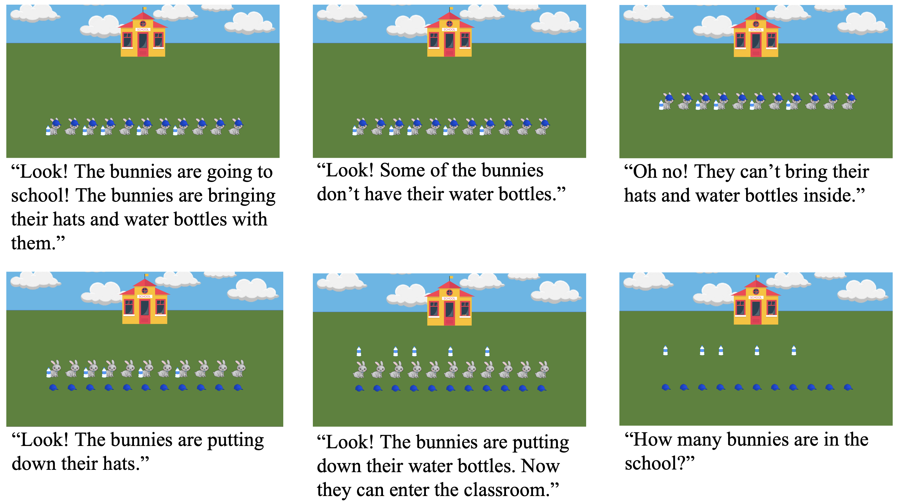

```{r setup, include = FALSE}
library("papaja")
r_refs("library.bib")

knitr::opts_chunk$set(include = FALSE)
```

```{r code setup, include=FALSE}
knitr::opts_chunk$set(
  echo = FALSE,
  warning = FALSE
)
library('tidyverse')
library("purrr")
library("uuid")
library('lubridate')
library('ggplot2')
library('lme4')
library('car')
library('report')
library('ggthemes')
library('emmeans')

library('cowplot')
library('prmisc')

library('chisq.posthoc.test')

theme_set(theme_classic())

# The palette with black:
cbPalette <- c("#E69F00", "#009E73", "#F0E442", "#0072B2", "#D55E00", "#56B4E9", "#CC79A7", "#000000")
```

```{r analysis-preferences}
# Seed for random number generation
set.seed(42)
knitr::opts_chunk$set(cache.extra = knitr::rand_seed)

print_coeff <- function(model, factor, factor_label = "") {
  coef = force_decimals(coef(summary(model))[factor, "Estimate"])
  ci1 = force_decimals(confint.merMod(model,method="Wald")[factor, '2.5 %'])
  ci2 = force_decimals(confint.merMod(model,method="Wald")[factor, '97.5 %'])
  p = format_p(coef(summary(model))[factor, "Pr(>|z|)"])
  return(paste("$\\beta$", factor_label, " = ", coef, ", ", 
      "95% CI = [", ci1, ", ", ci2, "], ", 
      p, sep = ""))
}

print_coeff_p <- function(model, factor, factor_label = "") {
  return(format_p(coef(summary(model))[factor, "Pr(>|z|)"]))
}

print_model_comp <- function(model_comp, factor) {
  df = model_comp[factor, "Df"]
  chi = force_decimals(model_comp[factor, "Chisq"])
  p = format_p(model_comp[factor, "Pr(>Chisq)"])
  return(paste("$\\chi^2$(", 
               df, ") = ", 
               chi, ", ", 
               p, sep = ""))
}

print_model_comp_p <- function(model_comp, factor) {
  return(format_p(model_comp[factor, "Pr(>Chisq)"]))
}
               
    
```

Imagine attending a lecture in an auditorium filled to capacity, where every seat is occupied by an eager student. After the lecture ends and everyone has left, you want to find out how many students attended. Is there a way to know? As numerate adults, we know that we can count the number of seats and then extend the resulting cardinal label (e.g., "ten") to the number of attendees. Understanding this principle, sometimes called "cardinal extension" [@muldoon2003], involves two distinct abilities. First, it requires the non-linguistic ability to recognize that two sets have the same number of items if and only if their members can be placed in one-to-one correspondence, sometimes called "Hume’s Principle" [@boolos1986; @decock2008; @frege1880; @frege1884; @heck2000]. Second, it requires understanding that a particular number word can be applied to two different sets if and only if they have an equal number of items. Therefore, cardinal extension integrates both non-linguistic reasoning about exact equality and linguistic knowledge of how number words encode number.

How do children acquire this knowledge? According to one view, once children learn their first 1-2 number words, they quickly infer that all number words denote unique, exact, numerosities. Previous studies establish that, beginning sometime after the age of 2, children learn the meanings of the words 'one', 'two', and 'three' one at a time over the course of 1-2 years, during which time they are known as "subset knowers" [since they know the meanings of only a subset of numbers, e.g., @wynn1990; @wynn1992]. According to @sarnecka2004, knowledge of these first few number word meanings might be sufficient to support an inference that all number words denote unique, exact, numerosities, and therefore that sets which differ in number should receive different numerical labels, while equinumerous sets should receive the same labels. Further, they suggest that this should extend even to words for which these children don’t yet have meanings. In support of this, they presented children who only knew words up to 'three' with a large set - e.g., "Look, there are five frogs", and found that when an item was added to the set and children were asked "Now are there five or six?" they correctly chose the alternative label (similar results were also found for subtraction trials). Children also correctly reasoned that the number word should not change when a transformation does not change the quantity (e.g., when a set is simply rearranged). Other studies, however, have questioned these results, finding that children fail with highly similar tasks [@brooks2013; @condry2008; @sarnecka2013]. For example, when subset knowers are shown two sets that appear equal in number, are told that one of them contains, e.g., 'six' things, and then see 1 item added to that set, they choose randomly between the two sets when asked to find the one with 'six' [e.g., @brooks2013; @condry2008]. Given such findings, some have argued that apparent successes may not demonstrate an understanding of how number words encode exact numerosities, but may instead reflect the use of a pragmatic inference compatible with the principle of contrast - i.e., that any referent that undergoes change along a meaning-relevant dimension should receive a new label [@brooks2013; see @izard2014 for a discussion].

According to an alternative hypothesis, children may not understand that number words denote unique, exact, numerosities until they understand how counting works, and are able to provide cardinal labels for any set they can count [@carey2004; @carey2009; @condry2008; @sarnecka2013]. Sometime after they learn the meanings of 'one', 'two', and 'three', children appear to discover that counting can be used to both construct large sets and label their cardinalities, at which point they are sometimes called "Cardinal Principle" knowers (or CP knowers). For example, in Wynn’s Give-a-Number task, when CP knowers are given a pile of objects, like fish, and asked to give "five fish", they are typically able to count and give the requested number, unlike subset knowers. According to some proposals, it is this ability to accurately count and construct large sets that establishes children’s understanding of how number words represent cardinality, since mastery of counting requires establishing one-to-one correspondence between labels and counted objects, which in turn guarantees that any two counts to a particular number - like five - will result in the same number [@carey2004; @carey2009]. As evidence for this, previous studies have found that CP knowers outperform subset knowers in tests of cardinal extension. For example, when shown two sets that appear equal in number, CP knowers often correctly judge that if a number word, e.g., ‘five,’ applies to one set, it should also apply to the other, while subset knowers fail at the same task [@sarnecka2013; @sarnecka2004]. Similarly, when shown a set of items that is labeled with a number word, e.g., ‘four turtles’, and asked to distinguish between two sets to find a set with the same number word label, CP knowers, but not subset knowers, succeed [@slusser2011]. These findings suggest that learning to accurately count and construct large numbers is related to a qualitative change in children’s understanding of how number words encode exact equality. 

While CP knowers are able to accurately count and label large sets, some have suggested that these abilities may actually reflect rote procedures [@davidson2012], and that many CP knowers still don’t understand that every number word denotes a unique cardinality, or that equinumerous sets should receive the same cardinal label. Instead, they have argued that this knowledge may emerge after children become CP knowers [for discussion see @schneider2022]. As evidence for this, although CP knowers outperform subset knowers on tests of cardinal extension, they rarely perform at ceiling, failing from 15% to 40% of the trials depending of the task [@sarnecka2013; @sarnecka2004; @slusser2011]. In fact, multiple past studies report variability on tests of cardinal extension until up to 5 years of age. However, in many cases these studies have not classified children’s knower levels, leaving open the role of counting knowledge in children’s performance. For example, in one study, @muldoon2005 showed 3- and 4-year-olds a set of lions who rode their bicycles to school and then disappeared inside it. Children were first asked how many bicycles there were – which they were able to count. They were then asked how many lions there were, to probe whether they can infer the number of a hidden set (the lions) from the number of a visible set in one-to-one correspondence (the bicycles), without having to count the lions. When the number of items was large (5 to 6 items), 3-year-olds extended the label of the visible set to the hidden set about 56% of the time, while 4-year-olds succeeded about 86% of the time [see also @sophian1995 for similar results with 5-year-olds^[Children were more successful at this task when the sets were small (2-3 items) – 3-year-olds succeeded 87% of the time and 4-year-olds 91% of the time. However, this might be due to children subitizing the sets while they were visible, memorizing the number of items of the hidden sets, and reporting it once asked.]]. In another study, @frydman1988 found that when two equal sets were generated through sharing, fewer than half of the 4-year-olds tested were able to infer the cardinality of one set by counting the other set. Similarly, @muldoon2003 asked 3.5 to 5-year-olds to construct a set equivalent to a set they had already counted, and to judge whether a new set that was one-too-many or one-too-few had the same number of items as the counted set. They found that roughly half of children succeeded in these tasks (ranging from 43% - 65% depending on the task). 

Adding to doubt that children master cardinal extension when they become CP knowers is the fact that such children often fail on tasks that test non-verbal understanding of one-to-one correspondence. First, classic Piagetian studies of conservation show some degree of difficulty in children well past the age of 5, though subsequent studies argued that such failures might be explained by alternative factors. For example, similar to the @brooks2013's pragmatic account of @sarnecka2004, some have argued that repeatedly asking children the same question about a referent set ("Which line has more?") may lead them to infer that a new response is required, and that they should therefore base their judgment on the property that changed (e.g., line length), rather than on number [@mcgarrigle1974; @mehler1967; @rose1974]. However, other studies have nevertheless found continuing failures in children as old as 6 on tasks that reduce these demands [@piaget1965; @russac1978; @schneider2022]. For example, using tasks similar to those used in tests of non-numerate groups like the Piraha and Mundurucu [@gordon2004; @pica2004], @schneider2022 presented children with a row of fish and asked them to match that row. Although both subset knowers and CP knowers performed better than chance when tested with small sets (e.g., 3), only CP knowers were better than chance for large sets, but many failed to provide exact matches, instead approximating. This was true even when children were explicitly asked to match the number, and when the task was presented as a sharing game where their goal was to ensure fairness in how fish were distributed to two penguins. Although some studies have shown precursors to one-to-one correspondence in younger children [@izard2014], here too success is limited to cases in which children can make judgments based on small sets^[In @izard2014, children continued searching when 3 puppets were presented on 3 branches, then were hidden in a box, and 2 were removed from the box. They also succeeded when 6 puppets were presented on 6 branches, and 5 came out. However they failed when 6 puppets were presented on 11 branches and 5 came out, suggesting that their success in the 5/6 case was driven by their ability to track a small number of empty branches, not their ability to track 5 objects.
]. 

To summarize, previous studies have debated when and how children acquire the two core components of cardinal extension - i.e., that two equal sets should receive the same label, and that two sets are equal only if their elements stand in one-to-one correspondence. Some argue that this knowledge emerges after children learn just 1-2 small number words, while others argue that it develops when children become CP knowers, or even sometime after this. Critically, however, previous studies are limited in various ways that make it difficult to know how such knowledge actually arises. First, some studies test cardinal extension and find variability between the ages of 3 and 5, but do not classify children into knower levels, making it difficult to know how their performance relates to knowledge of counting [e.g., @frydman1988; @muldoon2003; @muldoon2005; @sophian1995]. Second, other studies have classified children as subset knowers or CP knowers and tested differences between these groups, but have not analyzed sources of individual differences between children within these groups [e.g., @sarnecka2004; @sarnecka2013; @slusser2011]. Third, as we explain below, while cardinal extension requires two components (recognizing equinumerous sets and understanding that such sets share the same number label), previous studies typically test only one or the other, but rarely test both. 

Crucially, most studies that attempt to test both children’s reasoning about equinumerosity and how they use this knowledge to extend number labels [e.g., @sarnecka2004] do not differentiate between reasoning about exact vs. approximate representations of number^[One study, @sophian1995, did include trials that could differentiate between an exact equality vs. approximate quantity strategy, but did not report separate trial performance.]. This is important, because children might represent two sets as "the same" using approximate representations of number, even if the sets violate one-to-one correspondence and differ by 1 item^[As already noted, one exception to this is @sarnecka2004, which found that subset knowers who extend number words to two equal sets subsequently refuse to do so after an object is added to one of them. However, in addition to conflicting with results from other tasks, this study did not test whether children’s change in judgment was due to a violation of one-to-one, or the more general pragmatic heuristics that “a change in number should reflect a change in number word”, which is neutral with respect to whether - and how - children represent the sets as equal [@brooks2013].]. A large literature indicates that human perception of large sets is supported by representations in the Approximate Number System [ANS, @cordes2001; @dehaene1997; @dehaene2009; @whalen1999; @feigenson2004] such that sets that differ by large ratios - e.g., 2:1, 2:3 - are easy to discriminate, while sets with smaller ratios often are not. Although the acuity of this system improves with age [@halberda2008; @huntleyfenner2000], even adults often fail to reliably discriminate large sets that have a ratio less than 7:8. Meanwhile, accurate and adult-like set comparison for sets beyond the subitizable range with perceptually non-discriminable ratios requires precise representations of numerosities [see @feigenson2004 for a discussion]. Consequently, in order to be sure that children extend number words to sets that are exactly equal, it’s critical to ensure that their extension is not based on approximate matches between sets. While some studies have attempted to do this by showing children two equal sets and then adding or subtracting 1 item from one set [e.g., @sarnecka2004], in such studies children might assume that any change in number requires a change in label without knowing how to assess equality, and also without thinking that this principle of contrast is specific to number [see, e.g., @brooks2013, for evidence that children make identical patterns of inference for changes in an object’s part-whole structure]. 

The present studies aimed to address the limitations of past reports. Adapting the animal-bicycle task from @muldoon2005 in Experiment 1, we presented subset knowers and CP knowers with two sets of animals in unequal numbers - 5 bunnies and 7 lions. Animals in each group carried items (e.g., the bunnies had blue hats and the lions had red hats), such that the number of items was exactly equal to the number of animals in each group. The animal sets were then hidden, and children were prompted to infer the number of one of the two hidden animal sets (e.g., the number of bunnies). We reasoned that if children believe that two equal sets  deserve the same numerical label, they should count the correct visible objects to infer the number of hidden objects (e.g., counting the bunnies’ hats to infer the number of bunnies). In Experiment 2, we probed the nature of the numerical representations used by children who appeared to succeed at cardinal extension, by asking whether they reasoned about exact equality or approximate magnitudes. In addition to exploring differences in performance between CP- and subset knowers, we also investigated children’s age and familiarity with counting as possible factors explaining variability within each knower level group.

```{r get data}
df.ppt_raw_1 <- read.csv('../../../data/exp1/PROCESSED_DATA/exp1_ppt.csv')
df.trial_raw_1 <- read.csv('../../../data/exp1/PROCESSED_DATA/exp1_trial.csv')

df.ppt_raw_2 <- read.csv('../../../data/exp2/PROCESSED_DATA/exp2_ppt.csv')
df.trial_raw_2 <- read.csv('../../../data/exp2/PROCESSED_DATA/exp2_trial.csv')
```

```{r study1 - exclusions}
#exclusions go here (or in a separate thing)
# exclude participants who missed more than 1 trial (completed fewer than 5)
ppt_excluded_completion_1 <- df.trial_raw_1 %>% 
  filter(is.na(count)) %>%
  group_by(id) %>%
  summarise(n_no_count = n()) %>%
  filter(n_no_count > 1) %>%
  pull(id)

df.ppt_1 <- df.ppt_raw_1 %>%
  filter(!id %in% ppt_excluded_completion_1)

df.trial_1 <- df.trial_raw_1 %>%
  filter(!id %in% ppt_excluded_completion_1, 
         exclude != "Y")
```

```{r study2 - exclusions}
ppt_excluded_completion_2 <- df.trial_raw_2 %>% 
  filter(is.na(count) & is.na(set_chosen)) %>%
  group_by(id) %>%
  summarise(n_no_count = n()) %>%
  filter(n_no_count > 1) %>%
  pull(id)

df.ppt_2 <- df.ppt_raw_2 %>%
  filter(!id %in% ppt_excluded_completion_2)

df.trial_precounted_2 <- df.trial_raw_2 %>%
  filter(!is.na(precounted))

df.trial_2 <- df.trial_raw_2 %>%
  filter(!id %in% ppt_excluded_completion_2) %>%
  filter(is.na(precounted))
```

```{r refactor}
df.trial_1 <- df.trial_1 %>% 
  mutate(knower_level_cp_subset = factor(knower_level_cp_subset, levels = c("subset", "CP")),
         magnitude = factor(magnitude, levels = c("small", "large")))

df.trial_2 <- df.trial_2 %>% 
  mutate(trial_type = factor(trial_type, levels = c("small", "large-DR", "large-NDR"), 
                             labels = c("small", "large-DR", "large-NR")))
```
# Experiment 1

## Method

### Participants

```{r study1 - summarize ppt}
df.ppt_knower_level_1 <- df.ppt_1 %>%
  count(knower_level_cp_subset)

df.ppt_knower_level_gender_1 <- df.ppt_1 %>%
  count(knower_level_cp_subset, gender)

df.ppt_summary_1 <- df.ppt_1 %>%
  group_by(knower_level_cp_subset) %>%
  summarise(mean_age = mean(age_years_cont),
            sd_age = sd(age_years_cont), 
            min_age = min(age_years_cont), 
            max_age = max(age_years_cont))
```

A preregistration is available at https://osf.io/3v2cn. 
`r df.ppt_raw_1 %>% pull(id) %>% length() %>% printnum(., numerals = F, capitalize= T)`^[We recruited four more CP knowers than preregistered due to an initial knower-level coding error.] children were recruited from preschools in the US and Canada, and a children's museum in the US.
All participants spoke English as a primary language. Based on preregistered criteria, we excluded `r ppt_excluded_completion_1 %>% length() %>% printnum(., numerals = F)` participants who did not provide a response for more than one trial of the Cardinal Extension task, and `r df.trial_raw_1 %>% filter(exclude == "Y") %>% nrow() %>% printnum(., numerals = F)` trials due to experimenter error. Our final sample included `r df.ppt_1 %>% count() %>% pull(n)` children, with `r df.ppt_knower_level_1 %>% filter(knower_level_cp_subset == "subset") %>% pull(n)` subset knowers (`r df.ppt_knower_level_gender_1 %>% filter(knower_level_cp_subset == "subset", gender == "F") %>% pull(n)`F, `r df.ppt_knower_level_gender_1 %>% filter(knower_level_cp_subset == "subset", gender == "M") %>% pull(n)`M; $M_{age}$ = `r df.ppt_summary_1 %>% filter(knower_level_cp_subset == "subset") %>% pull(mean_age) %>% force_decimals()` [`r df.ppt_summary_1 %>% filter(knower_level_cp_subset == "subset") %>% pull(min_age) %>% force_decimals()`; `r df.ppt_summary_1 %>% filter(knower_level_cp_subset == "subset") %>% pull(max_age) %>% force_decimals()`]; $SD_{age}$ = `r df.ppt_summary_1 %>% filter(knower_level_cp_subset == "subset") %>% pull(sd_age) %>% force_decimals()`) 
and `r df.ppt_knower_level_1 %>% filter(knower_level_cp_subset == "CP") %>% pull(n)` CP knowers (`r df.ppt_knower_level_gender_1 %>% filter(knower_level_cp_subset == "CP", gender == "F") %>% pull(n)`F, `r df.ppt_knower_level_gender_1 %>% filter(knower_level_cp_subset == "CP", gender == "M") %>% pull(n)`M; $M_{age}$ = `r df.ppt_summary_1 %>% filter(knower_level_cp_subset == "CP") %>% pull(mean_age) %>% force_decimals()` [`r df.ppt_summary_1 %>% filter(knower_level_cp_subset == "CP") %>% pull(min_age) %>% force_decimals()`; `r df.ppt_summary_1 %>% filter(knower_level_cp_subset == "CP") %>% pull(max_age) %>% force_decimals()`]; $SD_{age}$ = `r df.ppt_summary_1 %>% filter(knower_level_cp_subset == "CP") %>% pull(sd_age) %>% force_decimals()`). The sample size was determined with an *a priori* power analysis on G*Power version 3.1.9.6 [@gpower], and is adequate to achieve 80% power for detecting a medium effect, at a significance criterion of $\alpha$ = 0.05 for a linear regression with 3 predictors (Age, Knower Level, and Set Size). This study was approved by the UCSD Human Research Protections Program (Protocol #200520).

### Material & Procedure

All materials, data, and analysis code for the experiment are available at https://osf.io/eswa4.

#### Give-N

Participants were given a titrated Give-N task [following the procedure in @wynn1992] to classify them as either subset knowers or CP knowers. Participants were shown a box with fish and a plate, and were asked to “put N fish on the plate.” All participants started with ‘five’, and received increasingly larger numbers (N+1, up to ‘six’) if they succeeded and smaller numbers (N-1) if they failed. If the child gave the wrong number, they were prompted once to “count to make sure” and were allowed to fix their response. We recorded the largest number for which the child gave correct responses on at least two out of three trials. We excluded children who could not construct sets of ‘one’ on at least two out of three trials. Children who succeeded on sets of ‘five’ or ‘six’ on at least two out of three trials were designated as CP knowers, and those who only succeeded on smaller numbers (e.g., ‘one’, ‘two’, ‘three’, ‘four’) were designated as subset knowers.

#### Cardinal Extension 

Materials were prepared and presented as a slidedeck with recorded audio descriptions. Participants were first introduced to the animals used in the task (lions and bunnies). They then saw two familiarization trials with three animals, in which each animal was associated with one item (e.g., each bunny had a bike). They were then asked to report the number of animals by pointing to the screen and counting to familiarize them with the expectations for critical trials.

In each critical trial (Figure \@ref(fig:exp1-figure)), participants saw two unequal groups of animals (e.g., 5 bunnies and 7 lions), each on one side of the screen. Initially, each animal was physically connected to one item (e.g., each animal wore a hat), such that animals and items stood in one-to-one correspondence (e.g., 5 bunnies – 5 blue hats vs. 7 lions – 7 red hats). Each group of animals stood with their items in a vertical line with equal spacing to facilitate element tracking and counting. The animals then put down their items and disappeared into a school. Participants were then asked for the number of one set of animals (e.g., “How many bunnies are in the school?”). If participants gave a response without counting, they were encouraged to ‘point and count’ (the experimenter never specified what they should count). Out of `r df.trial_1 %>% length()` total trials, there were `r df.trial_1 %>% filter(knower_level_cp_subset == "CP", is.na(set_chosen), !is.na(final_count)) %>% nrow()` trials where CP knowers responded with a number but did not count (small sets: `r df.trial_1 %>% filter(knower_level_cp_subset == "CP", magnitude == "small", is.na(set_chosen), !is.na(final_count)) %>% nrow()`; large sets: `r df.trial_1 %>% filter(knower_level_cp_subset == "CP", magnitude == "large", is.na(set_chosen), !is.na(final_count)) %>% nrow()`), and there were `r df.trial_1 %>% filter(knower_level_cp_subset == "subset", is.na(set_chosen), !is.na(final_count)) %>% nrow()` trials where subset knowers responded with a number but did not count (small sets: `r df.trial_1 %>% filter(knower_level_cp_subset == "subset", magnitude == "small", is.na(set_chosen), !is.na(final_count)) %>% nrow()`; large sets: `r df.trial_1 %>% filter(knower_level_cp_subset == "subset", magnitude == "large", is.na(set_chosen), !is.na(final_count)) %>% nrow()`). If counting resulted in a different response, we analyzed the final count. Participants were allowed one opportunity to fix a wrong response. 

Participants saw six critical trials in total: three small-set trials where sets were less than  4 (1:2, 1:3, 2:3), and three large-set trials where sets were greater than 4 (5:7, 5:8, 6:7). Lions and bunnies were used for all trials, but they carried different kinds of items for each trial. Participants saw one out of six pseudo-randomized trial orders. Trials were counterbalanced for the target animals, side of set appearance, and which animal set is larger.

```{r exp1-figure, include = TRUE, fig.env = "figure", fig.pos = "h", fig.align='center', num.cols.cap=1, out.width = "100%", fig.cap = "Schematic of Experiment 1. Slides are presented in order, from left to right and top to bottom. The corresponding audio description is under each slide."}


```

#### Highest Count

This task was included as a general proxy of counting experience, to allow us to differentiate between CP knowers with different degrees of counting training. Participants were asked to “count as high as you can,” beginning from one. The experimenter prompted them with 'one' (but no other number) if they failed to respond, and they were prompted once after they stopped to keep counting. We recorded the highest number they reached without errors.

### Transparency & Openness

All materials, data, and analysis code for both Experiments 1 and 2 are available at https://osf.io/eswa4. Data were analyzed using R [Version 4.1.3, @R-base] and the R-packages *lme4* [@R-lme4], *car* [@R-car], *emmeans* [@R-emmeans], *ggplot2* [@R-ggplot2], *cowplot* [@R-cowplot], *tidyverse* [@R-tidyverse], and *papaja* [@R-papaja]. The design and analysis of both experiments were preregistered, and we report how we determined our sample size, all data exclusions, all manipulations, and all measures in the study.


## Results 

Our primary question was whether CP knowers were more likely to succeed at the Cardinal Extension task compared to subset knowers across both small and large sets. To test this, we asked whether children knew that to find the number of animals in the school (e.g., bunnies), they should count the items that these animals left outside the school (and which were therefore equal in number) - what we describe below as Correct Set Choice. To identify children who selected the correct set, we coded two kinds of response as correct. First,  we credited the child with a correct response if they counted the correct set. We counted these responses as correct even if they attempted the attempted count resulted in an incorrect response in order to recognize that some children might have an understanding that two equal sets deserve the same label but nevertheless make procedural counting errors (e.g., in the case of some CP knowers). Also, this allowed for the possibility, proposed by @sarnecka2004, that a subset knower might know that two large sets should receive the same label if they are equal, but might not be able to say how many items the sets actually contain (because they can’t yet count). Second, we also credited the child with a correct response if, despite not attempting to count, they nevertheless provided a correct numerical response. Here, we reasoned that such a response is most likely if the child has successfully identified the correct item set from which to infer the number of animals. 

We also included a secondary analysis to explore how often children provided a correct numerical response overall. Although children might understand cardinal extension while still making counting errors, it is nevertheless interesting to know how often children were able to provide the correct numerical response and were therefore fully adult-like (e.g., by choosing the right side, and accurately counting the available items). For this measure, we credited children with success if they provided the correct numerical response whether or not they pointed to the screen as part of obtaining their answer. However, if children clearly counted the wrong set (or both sets) and got the correct answer through a counting error, they were not credited with success. We will refer to this measure as ‘Correct Numerical Response’ in the following analysis. 


```{r study1 - descriptives}
df.summary_knower_level_correct_set_chosen_1 <- df.trial_1 %>%
  group_by(knower_level_cp_subset) %>%
  summarise(mean = mean(correct_set_chosen), sd = sd(correct_set_chosen))

df.summary_magnitude_correct_set_chosen_1 <- df.trial_1 %>%
  group_by(magnitude) %>%
  summarise(mean = mean(correct_set_chosen), sd = sd(correct_set_chosen))

df.summary_knower_level_magnitude_correct_set_chosen_1 <- df.trial_1 %>%
  group_by(magnitude, knower_level_cp_subset) %>% 
  summarise(mean = mean(correct_set_chosen), sd = sd(correct_set_chosen))
```

```{r study1 set choice - t tests}
t_subset_1 <- t.test(df.trial_1 %>% 
         filter(knower_level_cp_subset == "subset") %>%
         pull(correct_set_chosen),
       mu = 0.5)

t_cp_1 <- t.test(df.trial_1 %>% 
                   filter(knower_level_cp_subset == "CP") %>%
                   pull(correct_set_chosen),
                 mu = 0.5)

t_small_cp_1 <-t.test(df.trial_1 %>% 
         filter(magnitude == "small", 
                knower_level_cp_subset == "CP") %>%
         pull(correct_set_chosen),
       mu = 0.5)

t_large_cp_1 <- t.test(df.trial_1 %>% 
         filter(magnitude == "large", 
                knower_level_cp_subset == "CP") %>%
         pull(correct_set_chosen),
       mu = 0.5)

t_small_subset_1 <-t.test(df.trial_1 %>% 
         filter(magnitude == "small", 
                knower_level_cp_subset == "subset") %>%
         pull(correct_set_chosen),
       mu = 0.5)

t_large_subset_1 <- t.test(df.trial_1 %>% 
         filter(magnitude == "large", 
                knower_level_cp_subset == "subset") %>%
         pull(correct_set_chosen),
       mu = 0.5)
```

```{r study1 set choice - CP-subset comparison}
t_small_1 <- t.test(df.trial_1 %>%
                      filter(magnitude == "small", 
                             knower_level_cp_subset == "CP") %>%
                      pull(correct_set_chosen), 
                    df.trial_1 %>%
                      filter(magnitude == "small", 
                             knower_level_cp_subset == "subset") %>%
                      pull(correct_set_chosen)) 

t_large_1 <- t.test(df.trial_1 %>%
                      filter(magnitude == "large", 
                             knower_level_cp_subset == "CP") %>%
                      pull(correct_set_chosen), 
                    df.trial_1 %>%
                      filter(magnitude == "large", 
                             knower_level_cp_subset == "subset") %>%
                      pull(correct_set_chosen)) 

t_set_1 <- t.test(df.trial_1 %>%
                      filter(knower_level_cp_subset == "CP") %>%
                      pull(correct_set_chosen), 
                    df.trial_1 %>%
                      filter(knower_level_cp_subset == "subset") %>%
                      pull(correct_set_chosen)) 
```

```{r study1 - CP variability}
df.cp_summary_1 <- df.trial_1 %>%
  filter(knower_level_cp_subset == "CP") %>%
  group_by(id) %>%
  summarise(mean_correct_set_chosen = mean(correct_set_chosen))
```

```{r study1 count - descriptives}
df.summary_knower_level_correct_count_1 <- df.trial_1 %>%
  group_by(knower_level_cp_subset) %>%
  summarise(mean = mean(correct_count_when_correct_set_chosen), sd = sd(correct_count_when_correct_set_chosen))

df.summary_magnitude_correct_count_1 <- df.trial_1 %>%
  group_by(magnitude) %>%
  summarise(mean = mean(correct_count_when_correct_set_chosen), sd = sd(correct_count_when_correct_set_chosen))

df.summary_knower_level_magnitude_correct_count_1 <- df.trial_1 %>%
  group_by(magnitude, knower_level_cp_subset) %>% 
  summarise(mean = mean(correct_count_when_correct_set_chosen), sd = sd(correct_count_when_correct_set_chosen))
```

```{r study1 count - t tests}
t_subset_count_1 <- t.test(df.trial_1 %>% 
         filter(knower_level_cp_subset == "subset") %>%
         pull(correct_count_when_correct_set_chosen),
       mu = 0.5)

t_cp_count_1 <- t.test(df.trial_1 %>% 
                   filter(knower_level_cp_subset == "CP") %>%
                   pull(correct_count_when_correct_set_chosen),
                 mu = 0.5)

t_small_cp_count_1 <-t.test(df.trial_1 %>% 
         filter(magnitude == "small", 
                knower_level_cp_subset == "CP") %>%
         pull(correct_count_when_correct_set_chosen),
       mu = 0.5)

t_large_cp_count_1 <- t.test(df.trial_1 %>% 
         filter(magnitude == "large", 
                knower_level_cp_subset == "CP") %>%
         pull(correct_count_when_correct_set_chosen),
       mu = 0.5)

t_small_subset_count_1 <-t.test(df.trial_1 %>% 
         filter(magnitude == "small", 
                knower_level_cp_subset == "subset") %>%
         pull(correct_count_when_correct_set_chosen),
       mu = 0.5)

t_large_subset_count_1 <- t.test(df.trial_1 %>% 
         filter(magnitude == "large", 
                knower_level_cp_subset == "subset") %>%
         pull(correct_count_when_correct_set_chosen),
       mu = 0.5)
```

```{r study1 count - CP-subset comparison}
t_small_count_1 <- t.test(df.trial_1 %>%
                      filter(magnitude == "small", 
                             knower_level_cp_subset == "CP") %>%
                      pull(correct_count_when_correct_set_chosen), 
                    df.trial_1 %>%
                      filter(magnitude == "small", 
                             knower_level_cp_subset == "subset") %>%
                      pull(correct_count_when_correct_set_chosen)) 

t_large_count_1 <- t.test(df.trial_1 %>%
                      filter(magnitude == "large", 
                             knower_level_cp_subset == "CP") %>%
                      pull(correct_count_when_correct_set_chosen), 
                    df.trial_1 %>%
                      filter(magnitude == "large", 
                             knower_level_cp_subset == "subset") %>%
                      pull(correct_count_when_correct_set_chosen)) 

t_count_1 <- t.test(df.trial_1 %>%
                      filter(knower_level_cp_subset == "CP") %>%
                      pull(correct_count_when_correct_set_chosen), 
                    df.trial_1 %>%
                      filter(knower_level_cp_subset == "subset") %>%
                      pull(correct_count_when_correct_set_chosen)) 
```

First, we consider the ‘Correct Set Choice’ measure. Overall, CP knowers were more likely than subset knowers to choose the correct set to count for both small and large sets (see Table \@ref(tab:table1) for statistical results). 
Two-tailed one-sample t-tests found that only CP knowers ($M$ = `r df.summary_knower_level_correct_set_chosen_1 %>% filter(knower_level_cp_subset == "CP") %>% pull(mean) %>% force_decimals()`, $SD$ = `r df.summary_knower_level_correct_set_chosen_1 %>% filter(knower_level_cp_subset == "CP") %>% pull(sd) %>% force_decimals()`) performed better than chance at identifying the correct item set to infer the number of hidden animals (`r print_ttest(t_cp_1)`), and they succeeded for both small and large sets ($p$s < .001). Meanwhile, subset knowers ($M$ = `r df.summary_knower_level_correct_set_chosen_1 %>% filter(knower_level_cp_subset == "subset") %>% pull(mean) %>% force_decimals()`, $SD$ = `r df.summary_knower_level_correct_set_chosen_1 %>% filter(knower_level_cp_subset == "subset") %>% pull(sd) %>% force_decimals()`) performed at chance (`r print_ttest(t_subset_1)`), and failed to identify the correct set for both small and large sets ($p$s > .05).
However, despite their above-chance performance we found substantial variability in CP knowers’ performance: out of `r df.ppt_knower_level_1 %>% filter(knower_level_cp_subset == "CP") %>% pull(n)` CP knowers, only `r df.cp_summary_1 %>% filter(mean_correct_set_chosen == 1) %>% count() %>% pull(n)` (`r force_decimals(df.cp_summary_1 %>% filter(mean_correct_set_chosen == 1) %>% count() %>% pull(n) / df.ppt_knower_level_1 %>% filter(knower_level_cp_subset == "CP") %>% pull(n) * 100)`%) succeeded in identifying the correct set (either by attempting to count the correct set, or giving the correct numerical response without counting) in all six trials (binomial $p$ < .05). `r df.cp_summary_1 %>% filter(mean_correct_set_chosen <= 0.5) %>% nrow() %>% printnum(., numerals = F, capitalize = T)` CP knowers (`r force_decimals(df.cp_summary_1 %>% filter(mean_correct_set_chosen <= 0.5) %>% count() %>% pull(n) / df.ppt_knower_level_1 %>% filter(knower_level_cp_subset == "CP") %>% pull(n) * 100)`%) succeeded in only half of the trials or fewer.

```{r table1, include = T}
table <- data.frame(check.names = F,
    `Cardinal extension performance` = c(
      "Correct Set Choice", 
      "  Small sets", 
      "  Large sets", 
      "  Total", 
      "Correct Numerical Response", 
      "  Small sets", 
      "  Large sets", 
      "  Total"
    ),
    `M` = c("", 
            df.summary_knower_level_magnitude_correct_set_chosen_1 %>% 
              filter(magnitude == "small", knower_level_cp_subset == "subset") %>% pull(mean) %>% printnum(), 
            df.summary_knower_level_magnitude_correct_set_chosen_1 %>% 
              filter(magnitude == "large", knower_level_cp_subset == "subset") %>% pull(mean) %>% printnum(),
            df.summary_knower_level_correct_set_chosen_1 %>%
              filter(knower_level_cp_subset == "subset") %>% pull(mean) %>% printnum(),
            "", 
            df.summary_knower_level_magnitude_correct_count_1 %>% 
              filter(magnitude == "small", knower_level_cp_subset == "subset") %>% pull(mean) %>% printnum(), 
            df.summary_knower_level_magnitude_correct_count_1 %>% 
              filter(magnitude == "large", knower_level_cp_subset == "subset") %>% pull(mean) %>% printnum(),
            df.summary_knower_level_correct_count_1 %>%
              filter(knower_level_cp_subset == "subset") %>% pull(mean) %>% printnum()),
    `SD` =  c("", 
            df.summary_knower_level_magnitude_correct_set_chosen_1 %>% 
              filter(magnitude == "small", knower_level_cp_subset == "subset") %>% pull(sd) %>% printnum(), 
            df.summary_knower_level_magnitude_correct_set_chosen_1 %>% 
              filter(magnitude == "large", knower_level_cp_subset == "subset") %>% pull(sd) %>% printnum(),
            df.summary_knower_level_correct_set_chosen_1 %>%
              filter(knower_level_cp_subset == "subset") %>% pull(sd) %>% printnum(),
            "", 
            df.summary_knower_level_magnitude_correct_count_1 %>% 
              filter(magnitude == "small", knower_level_cp_subset == "subset") %>% pull(sd) %>% printnum(), 
            df.summary_knower_level_magnitude_correct_count_1 %>% 
              filter(magnitude == "large", knower_level_cp_subset == "subset") %>% pull(sd) %>% printnum(),
            df.summary_knower_level_correct_count_1 %>%
              filter(knower_level_cp_subset == "subset") %>% pull(sd) %>% printnum()))
table2 <- data.frame(
    `M` = c("", 
            df.summary_knower_level_magnitude_correct_set_chosen_1 %>% 
              filter(magnitude == "small", knower_level_cp_subset == "CP") %>% pull(mean) %>% printnum(), 
            df.summary_knower_level_magnitude_correct_set_chosen_1 %>% 
              filter(magnitude == "large", knower_level_cp_subset == "CP") %>% pull(mean) %>% printnum(),
            df.summary_knower_level_correct_set_chosen_1 %>%
              filter(knower_level_cp_subset == "CP") %>% pull(mean) %>% printnum(),
            "", 
            df.summary_knower_level_magnitude_correct_count_1 %>% 
              filter(magnitude == "small", knower_level_cp_subset == "CP") %>% pull(mean) %>% printnum(), 
            df.summary_knower_level_magnitude_correct_count_1 %>% 
              filter(magnitude == "large", knower_level_cp_subset == "CP") %>% pull(mean) %>% printnum(),
            df.summary_knower_level_correct_count_1 %>%
              filter(knower_level_cp_subset == "CP") %>% pull(mean) %>% printnum()),
    `SD` =  c("", 
            df.summary_knower_level_magnitude_correct_set_chosen_1 %>% 
              filter(magnitude == "small", knower_level_cp_subset == "subset") %>% pull(sd) %>% printnum(), 
            df.summary_knower_level_magnitude_correct_set_chosen_1 %>% 
              filter(magnitude == "large", knower_level_cp_subset == "subset") %>% pull(sd) %>% printnum(),
            df.summary_knower_level_correct_set_chosen_1 %>%
              filter(knower_level_cp_subset == "subset") %>% pull(sd) %>% printnum(),
            "", 
            df.summary_knower_level_magnitude_correct_count_1 %>% 
              filter(magnitude == "small", knower_level_cp_subset == "subset") %>% pull(sd) %>% printnum(), 
            df.summary_knower_level_magnitude_correct_count_1 %>% 
              filter(magnitude == "large", knower_level_cp_subset == "subset") %>% pull(sd) %>% printnum(),
            df.summary_knower_level_correct_count_1 %>%
              filter(knower_level_cp_subset == "subset") %>% pull(sd) %>% printnum()),
    `t` = c("", 
            t_small_1$statistic %>% printnum(), 
            t_large_1$statistic %>% printnum(), 
            t_set_1$statistic %>% printnum(),
            "", 
            t_small_count_1$statistic %>% printnum(),
            t_large_count_1$statistic %>% printnum(), 
            t_count_1$statistic %>% printnum()), 
    `df` = c("", 
            t_small_1$parameter %>% printnum(), 
            t_large_1$parameter %>% printnum(), 
            t_set_1$parameter %>% printnum(),
            "", 
            t_small_count_1$parameter %>% printnum(),
            t_large_count_1$parameter %>% printnum(), 
            t_count_1$parameter %>% printnum()),
    `p` = c("", 
            t_small_1$p.value %>% printp(), 
            t_large_1$p.value %>% printp(), 
            t_set_1$p.value %>% printp(),
            "", 
            t_small_count_1$p.value %>% printp(),
            t_large_count_1$p.value %>% printp(), 
            t_count_1$p.value %>% printp())
  )

apa_table(
  cbind(table, table2),
  caption = "Results of t-tests comparing cardinal extension performance between subset- and CP knowers.",
  col_spanners = list("subset" = c(2,3), "CP" = c(4,5)),
  note = "Performance for each trial is coded as follows. For ‘Correct Set Choice’, 1: attempted to count the correct set (regardless of correct or incorrect numerical response), or provided the correct numerical response without counting, 0: counted the wrong set or both sets, or provided the wrong numerical response without counting. For ‘Correct Numerical Response,’ 1: provided the correct numerical response (by counting the correct set or without counting at all), 0: provided the wrong numerical response, or counted the wrong set or both sets (even if the right numerical response was reached through a counting error).",
)
```

```{r study1 - regressions - set base, include = F}
fit.base_set_1 <- glmer(correct_set_chosen ~ 
                          magnitude + age_zscored + (1|id) 
                        + (1|trial_ratio)
                        , 
                  data = df.trial_1, family="binomial")
summary(fit.base_set_1)
fit.anova.base_set_1 <- Anova(fit.base_set_1, type = 3)
```

```{r study1 - regressions - set base split, include = F}
#not-registered
#split by knower level
fit.base_set_cp_1 <- glmer(correct_set_chosen ~ magnitude + age_zscored + (1|id) 
                           + (1|trial_ratio)
                           , 
                     data = df.trial_1 %>% filter(knower_level_cp_subset == "CP"), 
                     family="binomial")
summary(fit.base_set_cp_1)
fit.anova.base_set_cp_1 <- Anova(fit.base_set_cp_1, type = 3)

fit.base_set_subset_1 <- glmer(correct_set_chosen ~ magnitude + age_zscored + (1|id)
                               + (1|trial_ratio)
                               , 
                     data = df.trial_1 %>% filter(knower_level_cp_subset == "subset"), 
                     family="binomial")
summary(fit.base_set_subset_1)
fit.anova.base_set_subset_1 <- Anova(fit.base_set_subset_1, type = 3)
```


```{r study1 - regressions - set enhanced models, include = F}
fit.cp_age_set_1 <- glmer(correct_set_chosen ~ knower_level_cp_subset + magnitude + age_zscored + (1|id) 
                          + (1|trial_ratio)
                          , data = df.trial_1, family="binomial")
summary(fit.cp_age_set_1)
fit.anova.cp_age_set_1 <- Anova(fit.cp_age_set_1, type = 3)
fit.compare.cp_age_set_1 <- anova(fit.cp_age_set_1, fit.base_set_1, type=3)

fit.cp_age_int_set_1 <- glmer(correct_set_chosen ~ knower_level_cp_subset * magnitude + age_zscored + (1|id) 
                          + (1|trial_ratio)
                          , data = df.trial_1, family="binomial")
summary(fit.cp_age_int_set_1)
fit.anova.cp_age_int_set_1 <- Anova(fit.cp_age_int_set_1, type = 3)
fit.compare.cp_age_int_set_1 <- anova(fit.cp_age_int_set_1, fit.cp_age_set_1, type=3)
```

In order to further analyze the effect of CP knowledge on cardinal extension performance as measured by Correct Set Choice, we constructed a generalized linear mixed-effects models (GLMM) with the formula Correct Set Choice (0/1) ~ Age (z-scored) + Set Size (Small / Large) + (1 | Participant) + (1 | Trial), and tested whether adding children’s Knower Level (CP / Subset) and Knower Level * Set Size interaction improved the fit of the model. All models included by-subject and by-item random intercepts. 
Our base model showed a significant effect of age (`r print_coeff(fit.base_set_1, "age_zscored")`), with older children performing better than younger children. However, set size (small vs large sets) did not further explain variation in performance (`r print_model_comp_p(fit.anova.base_set_1, "magnitude")`). Exploratory models analyzing subset knowers and CP knowers separately showed that this age effect was driven by only subset knowers (`r print_coeff(fit.base_set_subset_1, "age_zscored")`). Age did not predict performance in the CP knower group (`r print_coeff_p(fit.base_set_cp_1, "age_zscored")`). Adding Knower Level as a predictor significantly improved the fit of the model (`r print_model_comp(fit.compare.cp_age_set_1, "fit.cp_age_set_1")`), and revealed that CP knowers were significantly more likely than subset knowers to select the correct set, even when controlling for age (`r print_coeff(fit.cp_age_set_1, "knower_level_cp_subsetCP", "$_{CP}$")`). This model also showed a significant effect of age (`r print_coeff(fit.cp_age_set_1, "age_zscored")`) but not of set size  (`r print_model_comp_p(fit.anova.cp_age_set_1, "magnitude")`). These main effects are illustrated in Figure 2A. Adding Knower Level * Set Size interaction did not further improve the model (`r print_model_comp_p(fit.compare.cp_age_int_set_1, "fit.cp_age_int_set_1")`). 

```{r exp1-plot, fig.cap = "Each dot represents a participant. The width of the shaded area of violin plots represents the proportion of the data located there. A) Proportion of correct item set choice by participant against knower level. Horizontal dashed line indicates performance at chance = 0.50. B) Proportion of correct numerical response by participant against knower level.", fig.height = 4, include = T}
plot1 <- ggplot(data = df.trial_1 %>%
         mutate(magnitude = factor(magnitude, levels = c("small", "large"), labels = c("small sets", "large sets")), 
                         knower_level_cp_subset = factor(knower_level_cp_subset, levels = c("subset", "CP"))) %>%
         group_by(id, magnitude, knower_level_cp_subset) %>%
         summarise(mean_correct_set_chosen = mean(correct_set_chosen, na.rm = TRUE)),
       mapping = aes(x = knower_level_cp_subset, y = mean_correct_set_chosen)) + 
  geom_violin(aes(fill = knower_level_cp_subset)) +
  geom_jitter(height = 0, 
              alpha = 0.5) +  
  stat_summary(fun.data = "mean_cl_boot", 
               geom = "pointrange") +
    facet_grid(~ magnitude) + 
    scale_fill_manual(values=cbPalette) + 
  geom_hline(yintercept = 0.5, linetype = 2) +
  theme(legend.position = "none", 
        text = element_text(size = 11)) + 
  labs(y = "Prop. of correct set choice", 
       x = "Knower Level") 

plot2 <- ggplot(data = df.trial_1 %>%
         group_by(id, magnitude, knower_level_cp_subset) %>%
         mutate(magnitude = factor(magnitude, levels = c("small", "large"), labels = c("small sets", "large sets")), 
                         knower_level_cp_subset = factor(knower_level_cp_subset, levels = c("subset", "CP"))) %>%
         summarise(mean_correct_count = mean(correct_count_when_correct_set_chosen, na.rm = TRUE)), 
       mapping = aes(x = knower_level_cp_subset, y = mean_correct_count)) + 
  geom_violin(aes(fill = knower_level_cp_subset)) +
  geom_jitter(height = 0, 
              alpha = 0.5) +  
  stat_summary(fun.data = "mean_cl_boot", 
               geom = "pointrange") +
    facet_grid(~ magnitude) + 
  scale_fill_manual(values=cbPalette) + 
  theme(legend.position = "none", 
        text = element_text(size = 11)) + 
  labs(y = "Prop. of correct numerical response", 
       x = "Knower Level")

combined_plot <- plot_grid(plot1, plot2, labels = c('A', 'B'))
plot_grid(combined_plot, ncol=1,rel_heights = c(1, .1))
```

```{r study1 - count - CP variability}
df.cp_summary_count_1 <- df.trial_1 %>%
  filter(knower_level_cp_subset == "CP") %>%
  group_by(id) %>%
  summarise(mean_correct_count_when_correct_set_chosen = mean(correct_count_when_correct_set_chosen))

ppt_all_correct_count_1 <- df.cp_summary_count_1 %>%
  filter(mean_correct_count_when_correct_set_chosen == 1)

df.trial_cp_count_wrong_1 <- df.trial_1 %>%
  filter(knower_level_cp_subset == "CP") %>% 
  filter(!is.na(final_count), 
         correct_count_when_correct_set_chosen == 0)
```

We next asked how often participants gave the correct numerical response. Here we expected subset knowers would fail for large sets (since they generally can’t count accurately), and to sometimes succeed for smaller ones, and for CP knowers to perform better in both cases. Compatible with these expectations, Welch two-tailed two-sample t-test found that CP knowers provided the correct number of the hidden animal set more than subset knowers in both small and large sets (Table \@ref(tab:table1)). We again observed variability in CP knowers’ performance: out of `r df.ppt_knower_level_1 %>% filter(knower_level_cp_subset == "CP") %>% pull(n)` CP knowers, only `r ppt_all_correct_count_1 %>% nrow()` (`r force_decimals(ppt_all_correct_count_1 %>% nrow() / df.ppt_knower_level_1 %>% filter(knower_level_cp_subset == "CP") %>% pull(n) * 100)`%) succeeded in providing the correct numerical response for all six trials. `r df.cp_summary_count_1 %>% filter(mean_correct_count_when_correct_set_chosen <= 0.5) %>% nrow() %>% printnum(., numerals = F, capitalize = T)` CP knowers (`r force_decimals(df.cp_summary_count_1 %>% filter(mean_correct_count_when_correct_set_chosen <= 0.5) %>% nrow() / df.ppt_knower_level_1 %>% filter(knower_level_cp_subset == "CP") %>% pull(n) * 100)`%) succeeded in only half of the trials or fewer. 
Among CP knowers, some of these failures were due to procedural counting errors: out of `r df.trial_cp_count_wrong_1 %>% nrow()` trials where CP knowers gave the wrong numerical response, on `r df.trial_cp_count_wrong_1 %>% filter(correct_set_chosen == 1) %>% nrow()` trials (`r force_decimals(df.trial_cp_count_wrong_1 %>% filter(correct_set_chosen == 1) %>% nrow() / df.trial_1 %>% filter(knower_level_cp_subset == "CP", correct_count_when_correct_set_chosen == 0) %>% nrow() * 100)`%) they counted the correct item set but made a mistake in their count (even though we gave them one chance to fix their wrong count). 
On `r df.trial_cp_count_wrong_1 %>% filter(correct_set_chosen == 0, !is.na(set_chosen)) %>% nrow()` trials (`r force_decimals(df.trial_cp_count_wrong_1 %>% filter(correct_set_chosen == 0, !is.na(set_chosen)) %>% nrow() / df.trial_1 %>% filter(knower_level_cp_subset == "CP", correct_count_when_correct_set_chosen == 0) %>% nrow() * 100)`%), they counted the wrong item set, or both item sets, which pointed to a lack of cardinal extension understanding. Finally, on the remaining `r df.trial_cp_count_wrong_1 %>% filter(is.na(set_chosen)) %>% nrow()` trials (`r force_decimals(df.trial_cp_count_wrong_1 %>% filter(is.na(set_chosen)) %>% nrow() / df.trial_1 %>% filter(knower_level_cp_subset == "CP", correct_count_when_correct_set_chosen == 0) %>% nrow() * 100)`%), CP knowers provided the wrong numerical response without pointing to items in either visible set - a behavior compatible either with overconfidence in their ability to accurately estimate a set size, an attempt to count without pointing, or a failure to understand that the target number could be obtained by counting one of the visible sets. 

```{r study1 - regressions - count base, include = F}
fit.base_count_1 <- glmer(correct_count_when_correct_set_chosen ~ magnitude + age_zscored + (1|id) + (1|trial_ratio), 
                          data = df.trial_1, family="binomial")
summary(fit.base_count_1)
fit.anova.base_count_1 <- Anova(fit.base_count_1, type = 3)
```

```{r study1 - regressions - count enhanced models, include = F}
fit.cp_age_count_1 <- glmer(correct_count_when_correct_set_chosen ~ knower_level_cp_subset + magnitude + age_zscored + (1|id) + (1|trial_ratio), 
                          data = df.trial_1, family="binomial")
summary(fit.cp_age_count_1)
fit.anova.cp_age_count_1 <- Anova(fit.cp_age_count_1, type = 3)
fit.compare.cp_age_count_1 <- anova(fit.cp_age_count_1, fit.base_count_1, type = 3)

fit.cp_age_int_count_1 <- glmer(correct_count_when_correct_set_chosen ~ knower_level_cp_subset * magnitude + age_zscored + (1|id) + (1|trial_ratio), 
                          data = df.trial_1, family="binomial")
summary(fit.cp_age_int_count_1)
fit.anova.cp_age_int_count_1 <- Anova(fit.cp_age_int_count_1, type = 3)
fit.compare.cp_age_int_count_vs_base_1 <- anova(fit.cp_age_int_count_1, fit.base_count_1, type = 3)
fit.compare.cp_age_int_count_vs_noint_1 <- anova(fit.cp_age_int_count_1, fit.cp_age_count_1, type = 3)
```

To further explore the effect of CP knower status on Correct Numerical Response, we constructed another set of GLMMs with the same fixed and random effect structure as the first analytical approach to predict children’s ability to infer the correct number of animals. Specifically, our base model had the formula Correct Numerical Response (0/1) ~ Age (z-scored) + Set Size (Small / Large) + (1 | Participant) + (1 | Trial), and we tested whether adding children’s Knower Level (CP / Subset) and Knower Level * Set Size interaction improved the fit of the model. The model that best explained the data included Age, Knower Level, Set Size, and Knower Level * Set Size interaction as predictors (compared against base model with only Age and Set Size: `r print_model_comp(fit.compare.cp_age_int_count_vs_base_1, "fit.cp_age_int_count_1")`; compared against model with Age, Set Size and Knower Level: `r print_model_comp(fit.compare.cp_age_int_count_vs_noint_1, "fit.cp_age_int_count_1")`). CP knowers were significantly better at determining the correct number of animals (`r print_coeff(fit.cp_age_int_count_1, "knower_level_cp_subsetCP", "$_{CP}$")`), as were older children (`r print_coeff(fit.cp_age_int_count_1, "age_zscored")`). We also found an effect of Set Size with children more likely to provide the correct numerical response in trials with small sets compared to those with large sets (`r print_coeff(fit.cp_age_int_count_1, "magnitudelarge", "$_{large}$")`). Additionally, the Knower Level * Set Size interaction effect was significant, where subset knowers showed a larger difference in performance between small and large trials compared to CP knowers (`r print_coeff(fit.cp_age_int_count_1, "knower_level_cp_subsetCP:magnitudelarge", "$_{CP*large}$")`). These effects are illustrated in Figure 2B.

```{r study1 - regressions - highest count with set}
fit.cp_age_set_1_hc_comp <- glmer(correct_set_chosen ~ knower_level_cp_subset + magnitude + age_zscored + (1|id) 
                          + (1|trial_ratio)
                          , data = df.trial_1 
                          %>% filter(!is.na(highest_count)), family="binomial")

fit.cp_age_set_1_hc <- glmer(correct_set_chosen ~ highest_count + knower_level_cp_subset + magnitude + age_zscored + (1|id) 
                          + (1|trial_ratio)
                          , data = df.trial_1 
                          %>% filter(!is.na(highest_count)), family="binomial")

fit.compare.cp_age_set_1_hc <- anova(fit.cp_age_set_1_hc, fit.cp_age_set_1_hc_comp, type=3)
```

```{r study1 - regressions - highest count with count}
fit.cp_age_int_count_1_hc_comp <- glmer(correct_count_when_correct_set_chosen ~ knower_level_cp_subset * magnitude + age_zscored + (1|id) + (1|trial_ratio), 
                          data = df.trial_1 %>%
                            filter(!is.na(highest_count)), family="binomial")

fit.cp_age_int_count_1_hc <- glmer(correct_count_when_correct_set_chosen ~ highest_count + knower_level_cp_subset * magnitude + age_zscored + (1|id) + (1|trial_ratio), 
                          data = df.trial_1 %>%
                            filter(!is.na(highest_count)), family="binomial")


fit.compare.cp_age_int_count_1_hc <- anova(fit.cp_age_int_count_1_hc, fit.cp_age_int_count_1_hc_comp, type=3)
```

```{r study1 - regressions - highest count with only CP knowers}
fit.cp_age_set_1_hc_comp_only_cp <- glmer(correct_set_chosen ~ magnitude + age_zscored + (1|id) 
                          + (1|trial_ratio)
                          , data = df.trial_1 
                          %>% filter(!is.na(highest_count), 
                                     knower_level_cp_subset == "CP"), family="binomial")

fit.cp_age_set_1_hc_only_cp <- glmer(correct_set_chosen ~ highest_count + magnitude + age_zscored + (1|id) 
                          + (1|trial_ratio)
                          , data = df.trial_1 
                          %>% filter(!is.na(highest_count), 
                                     knower_level_cp_subset == "CP"), family="binomial")

fit.compare.cp_age_set_1_hc_only_cp <- anova(fit.cp_age_set_1_hc_only_cp, fit.cp_age_set_1_hc_comp_only_cp, type=3)

fit.cp_age_int_count_1_hc_comp_only_cp <- glmer(correct_count_when_correct_set_chosen ~ magnitude + age_zscored + (1|id) + (1|trial_ratio), 
                          data = df.trial_1 %>%
                            filter(!is.na(highest_count), 
                                     knower_level_cp_subset == "CP"), family="binomial")

fit.cp_age_int_count_1_hc_only_cp <- glmer(correct_count_when_correct_set_chosen ~ highest_count + magnitude + age_zscored + (1|id) + (1|trial_ratio), 
                          data = df.trial_1 %>%
                            filter(!is.na(highest_count), 
                                     knower_level_cp_subset == "CP"), family="binomial")


fit.compare.cp_age_int_count_1_hc_only_cp <- anova(fit.cp_age_int_count_1_hc_only_cp, fit.cp_age_int_count_1_hc_comp_only_cp, type=3)
```
As an exploratory analysis, we investigated whether children’s Highest Count explained further variability in our data, by adding it as a fixed effect to the best-performing models from the two analysis approaches above. `r df.ppt_1 %>% filter(!is.na(highest_count)) %>% pull(id) %>% length() %>% printnum(., numerals = F, capitalize = T)`children (out of `r df.ppt_1 %>% pull(id) %>% length()`) provided a Highest Count, so we refitted our best-performing models to only the data from these children. Adding Highest Count did not explain additional variation for either approach (Correct Set: `r print_model_comp(fit.compare.cp_age_set_1_hc, "fit.cp_age_set_1_hc")`; Correct Numerical Response: `r print_model_comp(fit.compare.cp_age_int_count_1_hc, "fit.cp_age_int_count_1_hc")`). When we limited this analysis to only CP knowers, Highest Count also did not explain additional variation in the observed performance ($p$s > .05).

## Discussion

Experiment 1 found three main results. First, CP knowers often chose the correct set to determine how many animals were hidden, compatible with some preliminary understanding of cardinal extension, while subset knowers completely failed. Second, although many CP knowers succeeded at this task, many also failed. Third, we found that many children failed to provide a correct numerical label, which could reflect a failure to understand cardinal extension, a lack of counting knowledge (e.g., in subset knowers), procedural counting errors, or a decision to not attempt to count during the task. Together, these results suggest that children do not acquire an understanding of cardinal extension prior to the CP-stage, and therefore that knowledge of just 1-2 number words is not sufficient to support this ability. Similarly, due to the variability in performance even among CP knowers, the data suggest that full mastery of cardinal extension likely emerges sometime after children learn to accurately count large sets. 

Although we found that CP knowers appeared to demonstrate some understanding of cardinal extension, Experiment 1 may still overestimate the number of children who grasp this principle for two reasons. First, in Experiment 1 - as in studies that use a similar design such as @muldoon2005 and @sophian1995 - children may have deployed a simple heuristic to choose the appropriate set that did not rely on understanding of cardinal extension. In particular, because there were two sets of animals, each with their own items, when children were asked, e.g., how many bunnies were in the school, they might have chosen to count the bunnies’ items based purely on the association between these animals and their items, but not based on their equinumerosity. Second, although animals and their target items in Experiment 1 were equal in number, this does not guarantee that children actually used this information as the basis for their judgments. Instead, as noted in the Introduction, it is possible that they chose which set to count based on its approximate match to the hidden set. We addressed these questions in Experiment 2.

# Experiment 2

Experiment 1 found that many CP knowers infer that sets which appear equal in number can be labeled by the same number word. However, the study left open how children arrive at this conclusion. One possibility is that they select the correct set by noticing a one-to-one correspondence between items and animals, and reasoning that because the two sets are equal they deserve the same label (e.g., exactly 5 bunnies and exactly 5 hats). Alternatively, they might compare only the approximate quantity of these sets (e.g., approximately 5 bunnies and approximately 5 hats). Finally, another possibility is that they might succeed by merely noting the association between the correct item set and the target animal set (e.g., the bunnies appear on the left, therefore choose the item set on the left; or the bunnies have blue hats, therefore choose the blue hats), without attending to cardinality at all. 

To probe whether children use exact or approximate representations to support cardinal extension, and to eliminate the possibility of using identity associations between animals and items, in Experiment 2 we paired one animal set with two item sets in varying ratios. One item set exhibited one-to-one correspondence with the animal set, and thus could be counted to infer the number of animals once hidden. The distractor item set either differed from the animal set in a perceptually discriminable ratio (e.g., 5 hats : 10 bunnies), or were off by one in quantity and were not discriminable according to their ratio (e.g., 9 hats : 10 bunnies). This design prevented children from attending to the item/animal identity as a strategy to solve the task. Additionally, it differentiated two set comparison strategies. If CP knowers succeed in cardinal extension through reasoning about one-to-one correspondence and exact set equality, they should succeed in both cases. However, if they only attend to approximate quantities, they should succeed in trials with discriminable ratios, but not in the off-by-one trials. 

## Method

### Participants

```{r study2 - summarize ppt}
df.gender_2 <- df.ppt_2 %>%
  count(gender)

df.ppt_summary_2 <- df.ppt_2 %>%
  summarise(mean_age = mean(age_years_cont),
            sd_age = sd(age_years_cont), 
            min_age = min(age_years_cont), 
            max_age = max(age_years_cont))
```

A preregistration is available at https://osf.io/zrsw2. 
`r df.ppt_raw_2 %>% pull(id) %>% length() %>% printnum(., numerals = F, capitalize= T)` children were recruited from preschools and a children’s museum in the US. Given the failure of subset knowers in Experiment 1, all participants were CP knowers who spoke English as a primary language. We excluded `r ppt_excluded_completion_2 %>% length() %>% printnum(., numerals = F)` participants who missed more than one trial of the Cardinal Extension task based on preregistered criteria. We also excluded `r df.trial_raw_2 %>% filter(!is.na(precounted)) %>% nrow()` trials where participants started counting the animals before the prompt, to ensure we only analyzed numerical responses from participants who attempted to make the inference after the animal set was hidden. Our final sample included `r df.ppt_2 %>% count() %>% pull(n)` CP knowers (`r df.gender_2 %>% filter(gender == "F") %>% pull(n)`F, `r df.gender_2 %>% filter(gender == "M") %>% pull(n)`M; $M_{age}$ = `r df.ppt_summary_2 %>% pull(mean_age) %>% force_decimals()` [`r df.ppt_summary_2 %>% pull(min_age) %>% force_decimals()`; `r df.ppt_summary_2 %>% pull(max_age) %>% force_decimals()`]; $SD_{age}$ = `r df.ppt_summary_2 %>% pull(sd_age) %>% force_decimals()`). The sample size was determined with an *a priori* power analysis on G*Power version 3.1.9.6 [@gpower], and is adequate to achieve 80% power for detecting a medium effect, at a significance criterion of $\alpha$ = 0.05 for a linear regression with 2 predictors (Age and Trial Type). This study was approved by the UCSD Human Research Protections Program (Protocol #200520).

### Material & Procedure

All materials, data, and analysis code for the experiment are available at https://osf.io/eswa4.

#### Give-N

Participants were given a Give-N task and a Highest Count task following the procedure from Experiment 1. In order to be confident that the children in this study were CP knowers, we used a more conservative criterion for CP status than in Experiment 1, and classified children as CP knowers only if they succeeded at constructing sets of “six” two out of three times on the Give-N task. Children who did not meet this criterion did not proceed to the Cardinal Extension task. 

#### Cardinal Extension

Materials and procedure were similar to Experiment 1, with any differences noted. In the familiarization phase, participants saw an additional trial with three animals (in this study, only bunnies), but only two of them had items and one of them did not. The bunny missing an item was highlighted to the participant (“This bunny doesn’t have a carrot”). This was done to highlight the violation of one-to-one correspondence, to be sure that any child who failed at the task did so despite noticing violations of one-to-one. Participants were also asked to point and count the number of bunnies for this trial.  

In each critical trial (Figure \@ref(fig:exp2-figure)), a set of bunnies appeared at the bottom of the screen with two sets of items. One set of items (the target set) was exactly equal to the number of bunnies, and the other set (the distractor set) had fewer items (e.g., 11 bunnies with 11 hats and 5 water bottles). The audio description highlighted the violation of one-to-one correspondence between the distractor set and the set of bunnies (e.g., ‘Some of the bunnies don’t have their water bottles’). The experimenter also gestured to the bunny or bunnies missing any item. The bunnies then put down each item in each set one at a time (e.g., each bunny put down their hat, then each of the bunnies with backpacks put down their backpack), to further emphasize the one-to-one correspondence between the bunnies and the target set, and reiterate the mismatch with the distractor set. Like in Experiment 1, the bunnies then disappeared into a building, leaving their items behind. Participants were then asked for the number of bunnies, following the same procedure as described in Experiment 1. Here, like Experiment 1, sometimes participants gave a response without counting, despite being encouraged to ‘point and count’. Out of `r df.trial_2 %>% nrow()` total trials, there were `r df.trial_2 %>% filter(is.na(set_chosen), !is.na(final_count)) %>% nrow()` trials where CP knowers responded with a number but did not count (small trials: `r df.trial_2 %>% filter(trial_type == "small", is.na(set_chosen), !is.na(final_count)) %>% nrow()`; large trials with perceptually discriminable ratios: `r df.trial_2 %>% filter(trial_type == "large-DR", is.na(set_chosen), !is.na(final_count)) %>% nrow()`; large trials with off-by-one difference: `r df.trial_2 %>% filter(trial_type == "large-NR", is.na(set_chosen), !is.na(final_count)) %>% nrow()`).

Participants saw nine trials in total: three small-set trials where sets were less than 4 (1:2, 1:3, 2:3), and six large-set trials where sets were greater than 4. Large-set trials included three with discriminable ratios (Large-DR: 5:10, 5:11, 6:12) where the ratio between the bunnies and the distractor item set was at least 2:1, and three with non-discriminable ratios (Large-NR: 9:10, 10:11, 11:12) where the distractor set had one fewer item than the number of bunnies. Participants saw 1 of 4 pseudo-randomized trial orders and item pairings. The trials were partially-counterbalanced for order and location of item sets.

```{r exp2-figure, include = TRUE, fig.env = "figure", fig.pos = "h", fig.align='center', num.cols.cap=1, out.width = "100%", fig.cap = "Schematic of Experiment 2. Slides are presented in order, from left to right and top to bottom. The corresponding audio description is under each slide."}


```

## Results

```{r study2 - descriptives}
df.summary_correct_set_chosen_2 <- df.trial_2 %>%
  group_by(trial_type) %>%
  summarise(mean = mean(correct_set_chosen), sd = sd(correct_set_chosen))
```

```{r study2 - t-tests}
t_all_2 <- t.test(df.trial_2 %>% 
                    pull(correct_set_chosen), 
                  mu = 0.5)

t_small_2 <- t.test(df.trial_2 %>% 
         filter(trial_type == "small") %>% 
         pull(correct_set_chosen), 
       mu = 0.5)

t_largedr_2 <- t.test(df.trial_2 %>% 
         filter(trial_type == "large-DR") %>% 
         pull(correct_set_chosen), 
       mu = 0.5)

t_largenr_2 <- t.test(df.trial_2 %>% 
         filter(trial_type == "large-NR") %>% 
         pull(correct_set_chosen), 
       mu = 0.5)
```


```{r study2 - variability}
df.summary_2 <- df.trial_2 %>%
  group_by(id, trial_type) %>%
  summarise(mean_correct_set_chosen = mean(correct_set_chosen)) %>%
  pivot_wider(names_from = trial_type, 
              values_from = mean_correct_set_chosen)

ppt_all_correct_2 <- df.summary_2 %>%
  filter(small == 1, `large-DR` == 1, `large-NR` == 1) %>%
  pull(id)

ppt_correct_nr <- df.summary_2 %>%
  filter(`large-NR` == 1) %>%
  pull(id)

df.ppt_all_correct_2 <- df.ppt_2 %>%
  filter(id %in% ppt_all_correct_2) %>%
  summarise(mean_age = mean(age_years_cont), 
            mean_hc = mean(highest_count, na.rm = T))

df.ppt_not_all_correct_2 <- df.ppt_2 %>%
  filter(!id %in% ppt_all_correct_2) %>%
  summarise(mean_age = mean(age_years_cont), 
            mean_hc = mean(highest_count, na.rm = T))
```

Our primary questions were (1) whether children chose the correct set to infer the number of bunnies across trials of different set sizes and ratios, and (2) whether children who did this drew on one-to-one correspondence or approximate number representations as the basis for their judgments. Similar to the analysis for Experiment 1, we first examined whether children made the Correct Set Choice. Two-tailed one-sample t-tests showed that overall performance was better than chance (`r print_ttest(t_all_2)`).
However, this was only true for small trials ($M$ = `r df.summary_correct_set_chosen_2 %>% filter(trial_type == "small") %>% pull(mean) %>% force_decimals()`, $SD$ = `r df.summary_correct_set_chosen_2 %>% filter(trial_type == "small") %>% pull(sd) %>% force_decimals()`; `r print_ttest(t_small_2)`) and large trials with perceptually-disciminable ratios ($M$ = `r df.summary_correct_set_chosen_2 %>% filter(trial_type == "large-DR") %>% pull(mean) %>% force_decimals()`, $SD$ = `r df.summary_correct_set_chosen_2 %>% filter(trial_type == "large-DR") %>% pull(sd) %>% force_decimals()`; `r print_ttest(t_largedr_2)`). In large trials with an off-by-one difference ($M$ = `r df.summary_correct_set_chosen_2 %>% filter(trial_type == "large-NR") %>% pull(mean) %>% force_decimals()`, $SD$ = `r df.summary_correct_set_chosen_2 %>% filter(trial_type == "large-NR") %>% pull(sd) %>% force_decimals()`), children performed at chance overall (`r print_ttest(t_largenr_2)`; Figure 4A). Out of `r df.ppt_2 %>% nrow()` children tested, only `r ppt_all_correct_2 %>% length()` (`r force_decimals(ppt_all_correct_2 %>% length() / df.ppt_2 %>% nrow() * 100)`%) succeeded in all trials, showing some evidence of using one-to-one correspondence in extending number words^[On average, these `r ppt_all_correct_2 %>% length()` children were slightly older and had a greater Highest Count score ($M_{age}$ = `r df.ppt_all_correct_2 %>% pull(mean_age) %>% force_decimals()`; $M_{HC}$ = `r df.ppt_all_correct_2 %>% pull(mean_hc) %>% force_decimals()`) compared to children who did not succeed in all trials ($M_{age}$ = `r df.ppt_not_all_correct_2 %>% pull(mean_age) %>% force_decimals()`; $M_{HC}$ = `r df.ppt_not_all_correct_2 %>% pull(mean_hc) %>% force_decimals()`), though due to the small number of children we could not compare these values. Note that one of these `r ppt_all_correct_2 %>% length()` children only contributed 4 trials (2 small trials, 1 large trial with perceptually-discriminable ratio, and 1 large trial with an off-by-one difference) because they began counting the bunnies before the animals disappeared on the other 5 trials. However, this child was included because they selected the correct set on all 4 of the trials they contributed, including the large trial with an off-by-one difference. Similarly, another one of these `r ppt_all_correct_2 %>% length()` children had 1 large trial with perceptually-discriminable ratio omitted due to precounting, but succeeded in all other 8 trials.]. 
An additional `r ppt_correct_nr %>% length() - ppt_all_correct_2 %>% length()` children succeeded in all large trials with an off-by-one difference, but made at least one mistake in the other trials. 

```{r exp2-plot, fig.cap = "Each dot represents a participant. The width of the shaded area of violin plots represents the proportion of the data located there. A) Proportion of correct item set choice by participant against trial type. Horizontal dashed line indicates performance at chance = 0.50. B) Proportion of correct numerical response by participant against trial type.", fig.height = 4, include = T}
plot3 <- ggplot(data = df.trial_2 %>% 
         mutate(trial_type = factor(trial_type, labels = c("small sets\n (e.g., 1:2)", "large sets,\n discriminable \n ratio (e.g., 5:10)", "large sets,\n off-by-one \n(e.g., 9:10)"))) %>%
         group_by(id, age_years, trial_type) %>%
         summarise(mean_correct_set = mean(correct_set_chosen, na.rm = FALSE)), 
       mapping = aes(x = trial_type, y = mean_correct_set)) +
  geom_violin(aes(fill = trial_type)) +
  geom_jitter(height = 0, 
              alpha = 0.5, 
              aes(group = id)) + 
  stat_summary(fun.data = "mean_cl_boot", 
               geom = "pointrange") +
  geom_hline(yintercept = 0.5, linetype = 2) +
  theme(legend.position = "none", 
        text = element_text(size = 11)) + 
  scale_fill_manual(values=cbPalette) + 
  scale_color_manual(values=cbPalette) +
  labs(y = "Prop. correct set choice", 
       x = "Set Size and Ratio"
       ) 

plot4 <- ggplot(data = df.trial_2 %>% 
         mutate(trial_type = factor(trial_type, labels = c("small sets\n (e.g., 1:2)", "large sets,\n discriminable \n ratio (e.g., 5:10)", "large sets,\n off-by-one \n(e.g., 9:10)"))) %>%
         group_by(id, trial_type) %>%
         summarise(mean_correct_count_with_set = mean(correct_count_when_correct_set_chosen, na.rm = FALSE)), 
       mapping = aes(x = trial_type, y = mean_correct_count_with_set)) +
  geom_violin(aes(fill = trial_type)) +
  geom_jitter(height = 0, 
              alpha = 0.5, 
              aes(group = id)) + 
  stat_summary(fun.data = "mean_cl_boot", 
               geom = "pointrange") +
  theme(legend.position = "none", 
        text = element_text(size = 11)) + 
  scale_fill_manual(values=cbPalette) + 
  scale_color_manual(values=cbPalette) +
  labs(y = "Prop. correct numerical response", 
       x = "Set Size and Ratio") 

combined_plot <- plot_grid(plot3, plot4, labels = c('A', 'B'))
plot_grid(combined_plot, ncol=1,rel_heights = c(1, .1))
```

```{r study2 - regressions - set, include = F}
#no effect of age
fit.base_set_2 <- glmer(correct_set_chosen ~ age_zscored + (1|id) + (1|trial_ratio), data = df.trial_2, family="binomial")
summary(fit.base_set_2)
fit.anova.base_set_2 <- Anova(fit.base_set_2, type = 3)

#there is an effect of trial type
fit.trial_type_set_2 <- glmer(correct_set_chosen ~ trial_type + age_zscored + (1|id) + (1|trial_ratio), 
                        data = df.trial_2, 
                        family="binomial")
summary(fit.trial_type_set_2)
fit.anova.trial_type_set_2 <- Anova(fit.trial_type_set_2, type = 3)

fit.compare.trial_type_set_2 <- anova(fit.trial_type_set_2, fit.base_set_2, type = 3)

# significant difference between DR and NDR, and between NDR and small. only difference between NDR and small is significant after Bonferroni correction. 
fit.contr.trial_type_set_2 <- summary(fit.trial_type_set_2 %>% 
                                    emmeans(specs = pairwise ~ trial_type,
                                            adjust = "bonferroni") %>% 
                                    pluck("contrasts"))
```

To further analyze the effect of trial type on selection of the Correct Set Choice, we constructed a GLMM with the formula Correct Set Choice (0/1) ~ Age (z-scored) + (1 | Participant) + (1 | Trial), and tested whether adding Trial Type (Small / Large with perceptually discriminable ratios (Large-DR) / Large with an off-by-one difference (Large-NR)) as fixed effects improved the fit of the model. All models included by-subject and by-item random intercepts. We found no effect of age in our base model (`r print_model_comp_p(fit.anova.base_set_2, "age_zscored")`). When trial type was included as a fixed effect, we found a significant effect of trial type (`r print_model_comp(fit.anova.trial_type_set_2, "trial_type")`), and still no effect of age (`r print_model_comp_p(fit.anova.trial_type_set_2, "age_zscored")`). The model with Trial Type explained significantly more variation in the observed data compared to the base model in a likelihood ratio test (`r print_model_comp(fit.compare.trial_type_set_2, "fit.trial_type_set_2")`). This finding replicated our finding from Experiment 1, which found that age did not explain cardinal extension performance in CP knowers. *Post hoc* pairwise comparisons between the three trial types (Small, Large-DR, Large-NR) with Bonferroni correction found that children were more likely to succeed in Small trials compared to Large-DR trials ($z$ = `r fit.contr.trial_type_set_2 %>% filter(contrast == "small - (large-DR)") %>% pull(z.ratio) %>% force_decimals()`, `r fit.contr.trial_type_set_2 %>% filter(contrast == "small - (large-DR)") %>% pull(p.value) %>% format_p()`) and Large-NR trials ($z$ = `r fit.contr.trial_type_set_2 %>% filter(contrast == "small - (large-NR)") %>% pull(z.ratio) %>% force_decimals()`, `r fit.contr.trial_type_set_2 %>% filter(contrast == "small - (large-NR)") %>% pull(p.value) %>% format_p()`). Success in Large-DR trials was also significantly higher than in Large-NR trials ($z$ = `r fit.contr.trial_type_set_2 %>% filter(contrast == "(large-DR) - (large-NR)") %>% pull(z.ratio) %>% force_decimals()`, `r fit.contr.trial_type_set_2 %>% filter(contrast == "(large-DR) - (large-NR)") %>% pull(p.value) %>% format_p()`).

```{r study2 - set - error chisq }
df.error_obs <- df.trial_2 %>%
  filter(trial_type != "small") %>%
  mutate(response_type = 
           case_when( 
               correct_set_chosen == 1 ~ "correct",
               set_chosen == "top" | set_chosen == "bottom" ~ "counted_wrong", 
               set_chosen == "both" ~ "counted_both", 
               is.na(set_chosen) ~ "counted_none",
             )) %>%
  group_by(trial_type, response_type) %>%
  count()

df.error_table <- df.error_obs %>%
  pivot_wider(names_from = trial_type, 
              values_from = n) %>%
  ungroup() %>%
  mutate(`large-DR` = paste(`large-DR`, " (", force_decimals(`large-DR` / sum(`large-DR`) * 100), "%)", sep = ""), 
         `large-NR` = paste(`large-NR`, " (", force_decimals(`large-NR` / sum(`large-NR`) * 100), "%)", sep = "")) %>%
  mutate(response_type = factor(response_type,
                                levels = c("correct", "counted_wrong",
                                           "counted_both", "counted_none"), 
                                labels = c("Correct", 
                                           "Incorrect, chose distractor set", 
                                           "Incorrect, chose both sets", 
                                           "Incorrect, did not choose a set")))

df.error_chisq <- df.error_obs %>%
  pivot_wider(names_from = response_type, 
              values_from = n) %>%
  ungroup() %>%
  select(!c(trial_type, correct))

chisq.test(df.error_chisq)

chisq.posthoc.test(df.error_chisq, round = 3)
```

We conducted an exploratory analysis evaluating children’s errors in choosing the correct set. Specifically, we reasoned that if children failed at large trials with an off-by-one difference (Large-NR) because they only attended to approximate quantities (choosing randomly between the two sets when they were off-by-one), then they should select the wrong set more often in such trials compared to large trials with discriminable ratios (Large-DR). Meanwhile, the rate of other error types, e.g., not choosing any set or attempting to count both sets, should be equal across Large-NR and -DR trials (see Table \@ref(tab:table2) for descriptive statistics). We performed a chi-square test of independence to examine the relation between error types (choosing the distractor set / choosing both sets / not choosing any set) and trial types (Large-DR / Large-NR), and found that there was a significant association between these variables, `r print_chi2(chisq.test(df.error_chisq))`. *Post hoc* comparisons of error types showed that children chose the distractor set at a significantly higher rate in the Large-NR trials (`r df.error_table %>% filter(response_type == "Incorrect, chose distractor set") %>% pull("large-NR") %>% str_sub(., start = 5, end = -2)`) compared to the Large-DR trials (`r df.error_table %>% filter(response_type == "Incorrect, chose distractor set") %>% pull("large-DR") %>% str_sub(., start = 5, end = -2)`) (`r chisq.posthoc.test(df.error_chisq) %>% filter(Dimension == 1, Value == "p values") %>% pull(counted_wrong) %>% str_sub(., end = -2) %>% format_p()`). In comparison, rates of incorrect responses due to choosing both sets and not choosing any set were statistically similar between the two trial types ($p$s > .05).

```{r table2, include = T}
apa_table(
  df.error_table,
  caption = "Distribution of responses in Large-DR and Large-NR trials.",
  align = c("m{6cm}", rep("m{4.5cm}", 2)),
  #align = paste0("m{", 1/(ncol(df.error_table) + 1), "\\linewidth}"),
  col.names = c("Type of responses", 
                "Large trials with discriminable ratios",
                "Large trials with an off-by-one difference"),
  col_spanners = list("Number and Percentage of Trials per Trial Type" = c(2,3))
)
```

```{r study2 count - descriptives}
df.summary_correct_count_2 <- df.trial_2 %>%
  group_by(trial_type) %>%
  summarise(mean = mean(correct_count_when_correct_set_chosen), 
            sd = sd(correct_count_when_correct_set_chosen))
```


```{r study2 count - CP variability}
df.summary_count_2 <- df.trial_2 %>%
  group_by(id) %>%
  summarise(mean_correct_count_when_correct_set_chosen = mean(correct_count_when_correct_set_chosen))

ppt_all_correct_count_2 <- df.summary_count_2 %>%
  filter(mean_correct_count_when_correct_set_chosen == 1)

df.trial_cp_count_wrong_2 <- df.trial_2 %>%
  filter(!is.na(final_count), 
         correct_count_when_correct_set_chosen == 0)
```

Similar to Experiment 1, we also conducted a follow-up analysis to explore how often participants gave the correct numerical response. On this measure, children succeeded in `r force_decimals(df.summary_correct_count_2 %>% filter(trial_type == "small") %>% pull(mean) * 100)`% of small trials, `r force_decimals(df.summary_correct_count_2 %>% filter(trial_type == "large-DR") %>% pull(mean) * 100)`% of large trials with perceptually discriminable ratios, and `r force_decimals(df.summary_correct_count_2 %>% filter(trial_type == "large-NR") %>% pull(mean) * 100)`% of large trials with an off-by-one difference (Figure 4B). We also found variability in the CP knowers tested: Out of `r df.ppt_2 %>% nrow()` children, `r ppt_all_correct_count_2 %>% nrow()` (`r force_decimals(ppt_all_correct_count_2 %>% nrow() / df.ppt_2 %>% nrow() * 100)`%) succeeded in providing the correct numerical response for all trials, thus demonstrating some understanding that one-to-one correspondence between sets determines that those two sets share the same number label. `r df.summary_count_2 %>% filter(mean_correct_count_when_correct_set_chosen <= 0.5) %>% nrow() %>% printnum(., numerals = F, capitalize = T)` children (`r force_decimals(df.summary_count_2 %>% filter(mean_correct_count_when_correct_set_chosen <= 0.5) %>% nrow() / df.ppt_2 %>% nrow() * 100)`%) succeeded in half or fewer trials. Out of `r df.trial_cp_count_wrong_2 %>% nrow()` trials where participants gave the wrong numerical response, `r df.trial_cp_count_wrong_2 %>% filter(correct_set_chosen == 1) %>% nrow()` trials (`r force_decimals(df.trial_cp_count_wrong_2 %>% filter(correct_set_chosen == 1) %>% nrow() / df.trial_cp_count_wrong_2 %>% nrow() * 100)`%) could be attributed to procedural error, where participants chose the correct set, but then counted wrongly. On `r df.trial_cp_count_wrong_2 %>% filter(correct_set_chosen == 0, !is.na(set_chosen)) %>% nrow()` trials (`r force_decimals(df.trial_cp_count_wrong_2 %>% filter(correct_set_chosen == 0, !is.na(set_chosen)) %>% nrow() / df.trial_cp_count_wrong_2 %>% nrow() * 100)`%), participants counted the wrong set or both sets, which indicated failure in identifying the correct set for cardinal extension inference. Finally, on `r df.trial_cp_count_wrong_2 %>% filter(is.na(set_chosen)) %>% nrow()` trials (`r force_decimals(df.trial_cp_count_wrong_2 %>% filter(is.na(set_chosen)) %>% nrow() / df.trial_cp_count_wrong_2 %>% nrow() * 100)`%), participants provided the wrong response but did not point to either set, which can either reflect overconfidence in estimating the number of items in the correct item set, or a lack of conceptual understanding about how the item set in one-to-one correspondence with the bunnies can be used to infer the number of bunnies. In comparison to the error pattern of CP knowers’ numerical response in Experiment 1, Experiment 2 found a larger proportion of errors that came from counting the wrong set or both sets, with this type of mistake accounting for more than half or the errors. 

```{r study2 - regressions - count, include = F}
#no effect of age
fit.base_count_2 <- glmer(correct_count_when_correct_set_chosen ~ age_zscored + (1|id) 
                          #+ (1|trial_ratio)
                          , data = df.trial_2, family="binomial")
summary(fit.base_count_2)
fit.anova.base_count_2 <- Anova(fit.base_count_2, type = 3)

#there is an effect of trial type
fit.trial_type_count_2 <- glmer(correct_count_when_correct_set_chosen ~ trial_type + age_zscored + (1|id) 
                                #+ (1|trial_ratio)
                                , 
                        data = df.trial_2, 
                        family="binomial")
summary(fit.trial_type_set_2)
fit.anova.trial_type_count_2 <- Anova(fit.trial_type_count_2, type = 3)

fit.compare.trial_type_count_2 <- anova(fit.trial_type_count_2, fit.base_count_2, type = 3)

# significant difference between DR and NDR, and between NDR and small. only difference between NDR and small is significant after Bonferroni correction. 
fit.contr.trial_type_count_2 <- summary(fit.trial_type_count_2 %>% 
                                    emmeans(specs = pairwise ~ trial_type,
                                            adjust = "bonferroni") %>% 
                                    pluck("contrasts"))
```

To further investigate the effect of different trial types on children’s numerical response,  we constructed a set of GLMMs with the same fixed and random effect structure as the Correct Set Choice analysis. However, we removed the by-trial random intercept due to overfitting. Specifically, our base model had the formula Correct Numerical Response (0/1) ~ Age (z-scored) + (1 | Participant), and we tested whether adding Trial Type (Small/Large-DR/Large-NR) improved the fit of the model. The model that best explained the data included both Age and Trial Type as predictors (compared against base model with only Age: `r print_model_comp(fit.compare.trial_type_count_2, "fit.trial_type_count_2")`). Older children were significantly better at providing the correct number of animals (`r print_coeff(fit.trial_type_count_2, "age_zscored")`). Children’s performance was also influenced by Trial Type (`r print_model_comp(fit.anova.trial_type_count_2, "trial_type")`), and *post hoc* pairwise comparisons with Bonferroni correction showed the same pattern of success across trial types as the above analysis. CP knowers were more successful in Small trials compared to Large-DR trials ($z$ = `r fit.contr.trial_type_count_2 %>% filter(contrast == "small - (large-DR)") %>% pull(z.ratio) %>% force_decimals()`, `r fit.contr.trial_type_count_2 %>% filter(contrast == "small - (large-DR)") %>% pull(p.value) %>% format_p()`) and Large-NR trials ($z$ = `r fit.contr.trial_type_count_2 %>% filter(contrast == "small - (large-NR)") %>% pull(z.ratio) %>% force_decimals()`, `r fit.contr.trial_type_count_2 %>% filter(contrast == "small - (large-NR)") %>% pull(p.value) %>% format_p()`), and success in Large-DR trials was also significantly more likely than in Large-NR trials ($z$ = `r fit.contr.trial_type_count_2 %>% filter(contrast == "(large-DR) - (large-NR)") %>% pull(z.ratio) %>% force_decimals()`, `r fit.contr.trial_type_count_2 %>% filter(contrast == "(large-DR) - (large-NR)") %>% pull(p.value) %>% format_p()`).

```{r study2 - regressions - highest count with set}
fit.trial_type_set_2_hc_comp <- glmer(correct_set_chosen ~ trial_type + age_zscored + (1|id) + (1|trial_ratio)
                          , data = df.trial_2
                          %>% filter(!is.na(highest_count)), family="binomial")

fit.trial_type_set_2_hc <- glmer(correct_set_chosen ~ highest_count + trial_type + age_zscored + (1|id) 
                                 + (1|trial_ratio)
                          , data = df.trial_2 
                          %>% filter(!is.na(highest_count)), family="binomial")

fit.compare.trial_type_set_2_hc <- anova(fit.trial_type_set_2_hc, fit.trial_type_set_2_hc_comp, type=3)
```

```{r study2 - regressions - highest count with count}
fit.trial_type_count_2_hc_comp <- glmer(correct_count_when_correct_set_chosen ~ trial_type + age_zscored + (1|id) 
                                        #+ (1|trial_ratio)
                                        , 
                          data = df.trial_2 %>%
                            filter(!is.na(highest_count)), family="binomial")

fit.trial_type_count_2_hc <- glmer(correct_count_when_correct_set_chosen ~ highest_count + trial_type + age_zscored + (1|id) 
                                   #+ (1|trial_ratio)
                                   , 
                          data = df.trial_2 %>%
                            filter(!is.na(highest_count)), family="binomial")


fit.compare.trial_type_count_2_hc <- anova(fit.trial_type_count_2_hc, fit.trial_type_count_2_hc_comp, type=3)
```

As an exploratory analysis, we added children’s Highest Count as a fixed effect to the best-performing models from the two analysis approaches above. `r df.ppt_2 %>% filter(!is.na(highest_count)) %>% nrow() %>% printnum(., numerals = F, capitalize = T)` children (out of `r df.ppt_2 %>% nrow()`) provided a Highest Count, so we refitted our best-performing models to only the data from these children. We found the same pattern as in Experiment 1: Highest Count did not explain additional variability for either approach (Correct Set: `r print_model_comp(fit.compare.trial_type_set_2_hc, "fit.trial_type_set_2_hc")`; Correct Numerical Response: `r print_model_comp(fit.compare.trial_type_count_2_hc, "fit.trial_type_count_2_hc")`).

```{r exp2.1 - get data}
df.ppt_2.1 <- read.csv('../../../data/exp2/PROCESSED_DATA/exp2.1_ppt.csv')
df.trial_2.1 <- read.csv('../../../data/exp2/PROCESSED_DATA/exp2.1_trial.csv')
```

```{r exp2.1 - summarize ppt}
df.gender_2.1 <- df.ppt_2.1 %>%
  count(gender)

df.ppt_summary_2.1 <- df.ppt_2.1 %>%
  summarise(mean_age = mean(age_years_cont),
            sd_age = sd(age_years_cont), 
            min_age = min(age_years_cont), 
            max_age = max(age_years_cont))
```

```{r exp2.1 - descriptives}
df.summary_correct_set_chosen_2.1 <- df.trial_2.1 %>%
  summarise(mean = mean(correct_set_chosen), sd = sd(correct_set_chosen))
```

During our analysis of data for Experiment 2, we became concerned that children might fail to select the correct set on large non-discriminable ratio (Large-NR) trials due to failures of memory. Specifically, given that the sets are not perceptually discriminable, after the bunnies disappeared into the school, children were required to recall which set was missing one item in order to prefer the other set that was an exact match. Therefore, children might fail at this task not because they lack an understanding of exact equality but because they can’t recall which set was exactly equal to the number of bunnies. To explore this possibility, we tested an additional `r df.ppt_2.1 %>% nrow()` CP knowers (`r df.gender_2.1 %>% filter(gender == "F") %>% pull(n)`F, `r df.gender_2.1 %>% filter(gender == "M") %>% pull(n)`M; $M_{age}$ = `r df.ppt_summary_2.1 %>% pull(mean_age) %>% force_decimals()` [`r df.ppt_summary_2.1 %>% pull(min_age) %>% force_decimals()`; `r df.ppt_summary_2.1 %>% pull(max_age) %>% force_decimals()`]; $SD_{age}$ = `r df.ppt_summary_2.1 %>% pull(sd_age) %>% force_decimals()`) on a reduced version of the task that included just 3 Large-NR critical trials and asked them at the end of each trial which set had a missing element (“There was a bunny that was missing something. What was it missing, a [item 1] or [item 2]?”). We found that all `r df.ppt_2.1 %>% nrow()` children remembered the missing item on all 3 trials. Critically, despite succeeding at this memory check, these children nevertheless showed the same rate of failure at cardinal extension, and chose the correct set only `r force_decimals(df.summary_correct_set_chosen_2.1 %>% pull(mean) * 100)`% of the time. This provides strong evidence that even when children recognize that only one set exactly matches the target set, they often choose an approximate match anyway.

## Discussion 

Experiment 2 found that while children who were classified as CP knowers succeeded on trials with small subitizable sets and large, perceptually discriminable sets, they generally failed when the distractor set and target set could not be discriminated using approximate number representations, and differed by just 1 item. A follow-up study found that this was not merely due to difficulties recalling which set was an exact match, and that children who were able to identify which set was missing an item nevertheless often made an approximate match regardless. These results suggest that, even when 3- to 6-year-old CP knowers engage in cardinal extension, their dominant strategy is to extend number words to sets that are perceptually non-discriminable, even when one-to-one correspondence is violated. Additionally, we again found substantial variability in CP knowers’ understanding of cardinal extension, with only a few children appearing to truly understand the relationship between one-to-one correspondence, equinumerosity, and cardinal extension. 

# General Discussion 

In two experiments, we investigated the role that counting knowledge plays in children’s understanding that equal sets should be given the same numerical label. We found three main results. First, compatible with some previous studies [e.g., @sarnecka2004; @sarnecka2013], Experiment 1 found that CP knowers were more likely than subset knowers to infer that two sets should receive the same number label only if they are numerically equal. In fact, subset knowers performed at chance for both small and large sets. This provides evidence against the hypothesis [@sarnecka2004] that children understand that all number words have exact meanings even before children become CP knowers and can construct sets of large numbers. Second, Experiment 1 found that although many CP knowers are able to choose the correct item set to infer the quantity of a hidden set, many also failed, suggesting that simply learning to count does not guarantee understanding of cardinal extension. Together, these data suggest that although learning how counting can be used to construct sets plays some role in understanding cardinal extension, full knowledge of this principle may not emerge at the point that children become CP knowers. Third, Experiment 2 provided further evidence that CP knowledge does not alone furnish understanding of cardinal extension. Although CP knowers often correctly extended labels to equal sets when they were within the subitizable range or had perceptually discriminable ratios, they did not use violations of one-to-one correspondence as a cue to exact equality and often extended the same label to large sets that differed by 1 item. This suggests that CP knowers initially may extend number words to sets that are perceptually indiscriminable, without regard to whether they stand in one-to-one correspondence. 

These results of these experiments are compatible with the hypothesis that full understanding of cardinal extension - and thus how number words label unique, exact, numerosities - does not emerge until sometime after children become competent counters. These data are difficult to explain for theories that predict earlier learning and particularly with the hypothesis that subset knowers understand that each number word denotes a unique, exact, cardinal number. When subset knowers - and some CP knowers - were asked to say how many animals were hidden in the school, they often counted the items of the wrong animal (Experiment 1). In doing so, these children failed to understand that only items from the same animal type - that were equal to the number of hidden animals - could predict the number of animals that were in the school. 

Our results also call into question the hypothesis that becoming a CP knower supplies this knowledge. According to some previous reports, becoming a CP knower involves constructing an analogical mapping between the order of the count list and the set of ordered cardinalities created by increments of one individual, and therefore noticing that there is a one-to-one correspondence between number words and exact cardinal values, *inter alia* [@carey2004; @carey2009]. This supports the inference that only sets in one-to-one correspondence are equinumerous and can be denoted by the same number word [@lecorre2007]. This account posits that learning the cardinal principle entails understanding that numbers have exact meanings, and that number words can only be extended between sets in one-to-one correspondence. Against this, Experiment 1 found that many CP knowers still did not succeed at cardinal extension. Moreover, Experiment 2 found that CP knowers performed at chance when tested with perceptually non-discriminable sets that clearly violated one-to-one correspondence. Taken together, our results suggest that even when CP knowers seem to succeed in cardinal extension (as in Experiment 1), they extend number words based on their approximate match in magnitude,  rather than on an exact match in number. Overall, this suggests that understanding of how number words encode exact equality continues to develop well after children master the counting procedures required to become a CP knower. 

While our results are broadly consistent with some previous findings, we also introduce several new findings to the literature, which may at first appear to conflict with some past studies. For example, our finding that CP knowers extend cardinal labels to two sets even if they violate one-to-one correspondence seems, at first, to be at odds with previous studies that document an ability among CP knowers to judge that sets that differ by just 1 item should be labeled by different number words [@sarnecka2004; @sarnecka2013]. However, like our study, these studies also found variability in CP knowers’ performance, suggesting that many CP knowers fail to recognize that equinumerous sets should receive the same label - the first component of cardinal extension. Also, it’s unclear from past studies whether these children who extended the same label to two sets were sensitive to exact equality - the second component of cardinal extension. For example, in @sarnecka2013 children had to judge whether two sets (5 vs. 6) were the same or different before being asked to provide numerical labels, and often received feedback when they failed to notice differences. Also, given how the items were arranged, children could use perceptual proxies like line length to approximate differences between the two sets, rather than using exact number. Similarly, as noted in the Introduction, although children in @sarnecka2004 judged that two previously equal sets should receive distinct numerical labels after one set had an item added or subtracted, children only needed to know the principle that “different numbers get different labels”, or even “different referents get different labels”, in keeping with the principle of contrast [see @brooks2013]. 

The central puzzle that flows from our findings is why CP knowers are able to use a one-to-one counting procedure to reliably count objects and construct large sets, but fail to use violations of one-to-one correspondence to inform cardinal extension. One possibility, proposed by @davidson2012, is that CP knowers have acquired the ability to construct large sets as one of several rote counting procedures that they acquire in early childhood [e.g., the ‘how-to-count’ principles described in @gelman1978; including the one-to-one principle, the stable order principle, and the last-word principle, *inter alia*]. On this hypothesis, CP knowers might know how to accurately count and construct large sets, but not understand the underlying conceptual principles that these rote behaviors reflect; that is, CP knowers’ understanding of counting reflects that they understand what counting is doing, but not what it is accomplishing [@heck2000]. For example, when asked to ‘give six fish,’ these children might follow a procedure in this form: ‘Begin counting from one, for each number word partition one item to a separate set, stop counting at six, and give all counted objects.’ This procedure results in an accurate set of six, but requires minimal conceptual understanding of the meaning of ‘six’ – for example, that ‘six’ denotes the same cardinality across any set constructed following the procedure or that ‘six’ denotes ‘exactly six.’ Lacking this understanding, these children might not realize that, if two sets stand in one-to-one correspondence, then counting one set indicates the cardinality of the second one. On this view, the “CP” in CP knower may not stand for “cardinal principle” but instead for “cardinal procedure”, since many CP knowers appear to lack an understanding of how counting represents cardinality, but know how to deploy a procedure that nevertheless returns accurate cardinal labels.

However, alternative explanations for CP knowers’ failure with cardinal extension also exist. One possibility, described by @schneider2022, is that very young children know that two sets are equal only if they stand in one-to-one correspondence, but they lack a reliable procedure for verifying this property for large sets - a critical prerequisite for adult-like cardinal extension. As noted by @schneider2022, studies of “parallel individuation” find that infants track small sets of hidden objects by assigning each a mental index, such that there is a one-to-one correspondence between these mental symbols and the things they represent [e.g., @feigenson2003]. However, these symbols are represented in parallel and are therefore subject to a capacity limit, such that infants cannot track more than 3 objects at a time. What infants lack, therefore, is a sequential, memory-free, verification procedure for establishing one-to-one correspondence. @schneider2022 argued that counting provides just such a procedure and solves the “partition” problem [@gelman1978], by partitioning a set, one object at a time, into counted vs. uncounted objects. As each item is counted, it is tagged with a number word, such that both that word and the object it labels are removed from further consideration (e.g., by setting it aside) and a one-to-one correspondence is created between words and objects. Consequently, to arrive at an exact response, the child needs only to keep track of where they currently are in the count list, and the next object they plan to count, making the process sequential and memory-free. One possibility, then, is that when children learn this one-to-one verification procedure, they extend the ability to sequentially map labels-to-objects to the problem of mapping objects-to-objects in sequence, a skill required for matching large sets.

One of the hypotheses outlined above suggests that children might struggle with cardinal extension because they lack conceptual understanding of counting, while the second hypothesis suggests they may struggle due to a lack of procedural knowledge for deploying their understanding of exact equality. Naturally, it’s possible - and perhaps even likely - that both are true. First, there is independent evidence that procedural knowledge of counting generally precedes conceptual understanding from early in development [@fuson1988; @fuson1983], and that this continues past the CP knower stage, as @davidson2012 document. Second, there is evidence that children struggle with non-verbal set matching tasks [@schneider2022], much in the way that innumerate groups like the Piraha and Mundurucu do [@gordon2004; @pica2004]. Additionally, it’s possible that children also differ from adults in other ways. For example, even once children become able to verify one-to-one correspondence and understand that equal sets should always receive the same label, they may simply prefer to use approximate strategies [see @izard2014], or may not think that the difference between an exact and an approximate solution is important. As decades of research on Piagetian conservation demonstrated, children with relatively advanced numerical knowledge often simply understand the requirements of a task differently than adults and “fail” for pragmatic, rather than semantic reasons [@mcgarrigle1974; @mehler1967; @rose1974].

Regardless of why some CP knowers fail at cardinal extension, it seems likely experience with counting plays a role in overcoming these challenges. Previous research has found that children are more successful at comparing cardinalities or constructing sets of the same quantities when they can count sets, as opposed to placing items in one-to-one correspondence [@cowan1989; @michie1984; @russac1978; @saxe1977]. This suggests a progression whereby children become increasingly accurate at counting to establish cardinalities, with the ability to integrate this with reasoning about how one-to-one correspondence can be used to determine logical set equality developing afterwards. Furthermore, previous research has shown that children’s counting proficiency seems to continue to develop even after they become CP knowers. For example, children who are classified as CP knowers on the basis of their ability to accurately give sets of 5 and 6 often make errors when counting larger sets, such as 7, 8, or 9 [@wagner2011; @krajcsi2023]. Additionally, @lecorre2006 found that CP knowers vary in their ability to recognize mistakes in counting procedures [for similar results with preschoolers, see also @briars1984; @gelman1983; @gelman1986]. Particularly relevant to the current discussion, @muldoon2003 found that children’s ability to detect violations of counting procedures predicted their success in a cardinal extension task (though this might be explained by the presence of subset knowers, since @muldoon2003 did not assess knower levels in this study). Perhaps as children gain more counting experience, they become better at deploying the counting procedures and noticing violations in counting. This might result in them realizing that violations of one-to-one between count words and items results in different numerical labels. More exposure to counting might also lead children to notice that adding or removing an item from a set results in a different cardinality. Given these possibilities, future studies should ask whether variability in cardinal extension performance among CP knowers might be explained by differing abilities to deploy counting procedures, as well as metacognitive abilities about the counting principles.

\newpage

# Acknowledgements

This research was funded by a National Science Foundation award (#2000827) to DB. We thank the participants, their parents, preschool teachers and directors, and the Fleet Science Center in San Diego, and also thank Elizabeth Hernandez, Christine Kwon, Urvi Maheshwari, and Mincong Wu for assistance with data collection. We are grateful for the feedback from the members of the Language and Development Lab at UC San Diego. 

\newpage

# References

::: {#refs custom-style="Bibliography"}
:::
